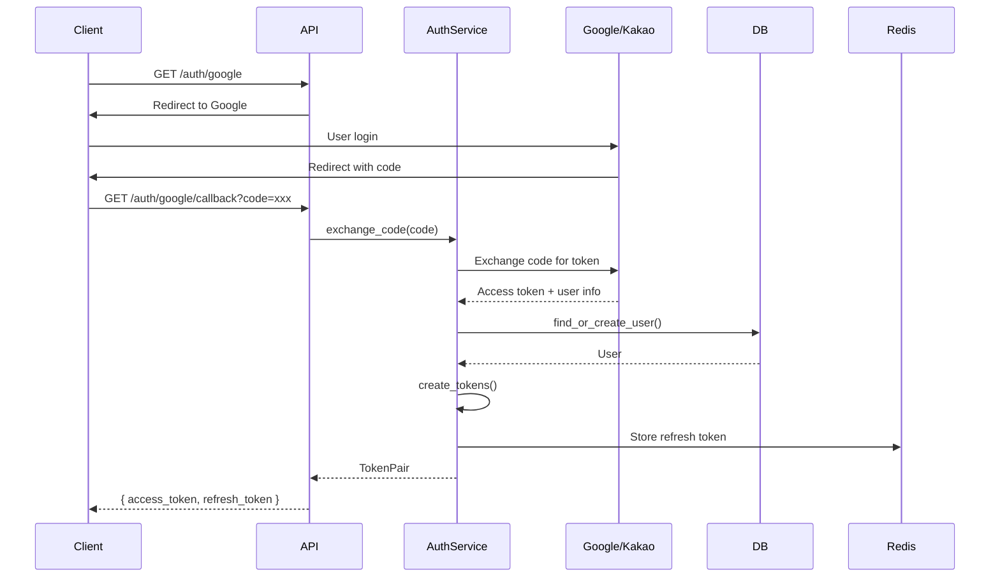
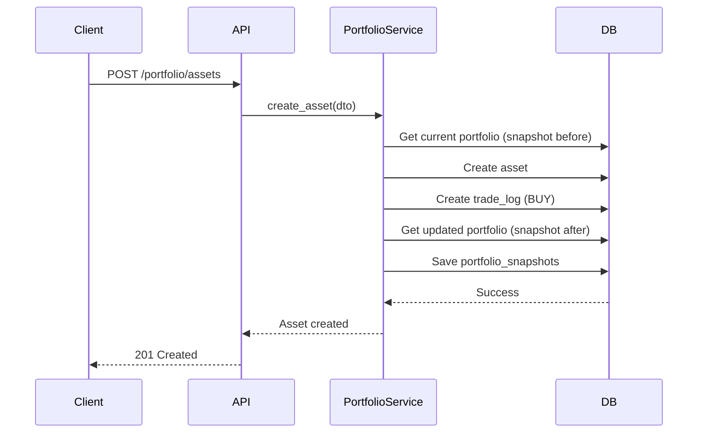
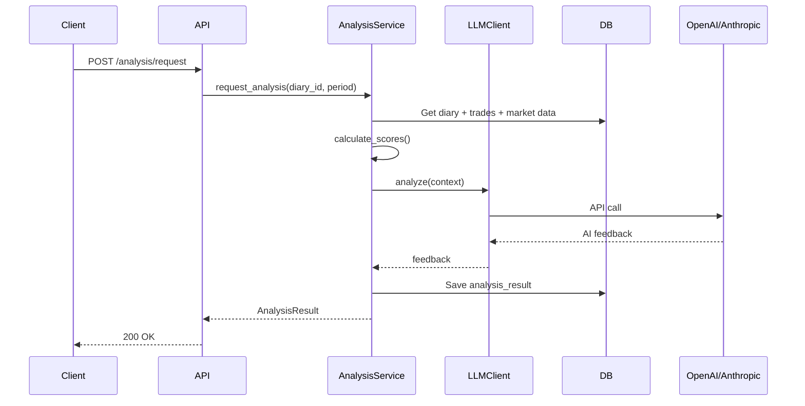

# Backend Design Doc: 투자일기

> Created: 2026-02-05
> Service: invest-diary
> Type: Backend
> Requirements document: docs/invest-diary/spec.md

## 0. Summary

### Goal
투자자가 매매 기록과 판단 근거를 체계적으로 기록하고, AI 분석을 통해 과거 판단의 정확도를 객관적으로 평가받아 투자 실력을 향상시키는 Backend API 서버

### Non-goals
- 실시간 주가 스트리밍 (MVP에서 제외)
- 증권사 API 연동 (MVP에서 제외)
- 커뮤니티/소셜 기능 (MVP에서 제외)

### Success metrics
- API 응답 시간 1초 이내
- 소셜 로그인 성공률 99% 이상
- AI 분석 요청 처리 시간 30초 이내

---

## 1. Scope

### In scope
- OAuth 2.0 소셜 로그인 (Google, Kakao)
- 포트폴리오 CRUD (국내/미국 주식)
- 포트폴리오 변경 시 자동 매매기록 생성
- 투자일기 CRUD (매매기록 연동)
- 시장 데이터 조회 (90일 Mock 데이터)
- AI 분석 요청 및 결과 조회
- 분석 결과 저장/히스토리

### Out of scope
- 실제 시장 데이터 API 연동 (Post-MVP)
- 고정일 자동 분석 알림 (Post-MVP)
- 자체 분석 vs AI 분석 비교 (Post-MVP)
- 증권사 연동, 커뮤니티 (Nice to Have)

---

## 1.5. Tech Stack

```yaml
tech_stack:
  language: "Python 3.11+"
  framework: "FastAPI"
  database: "PostgreSQL 15+"
  orm: "SQLAlchemy 2.x (async)"
  third_party:
    - "Redis (캐싱, 세션)"
    - "OpenAI/Anthropic (LLM 분석)"
  infra: "Docker, AWS/GCP (TBD)"
```

---

## 1.6. Dependencies

```yaml
package_manager: "uv"
project_type: "new"

dependencies:
  # Core framework
  - name: "fastapi"
    version: "latest"
    purpose: "Web framework"
    status: "approved"
  - name: "uvicorn[standard]"
    version: "latest"
    purpose: "ASGI server"
    status: "approved"
  - name: "pydantic-settings"
    version: "latest"
    purpose: "Configuration management"
    status: "approved"

  # Database / ORM
  - name: "sqlalchemy[asyncio]"
    version: ">=2.0"
    purpose: "Async ORM"
    status: "approved"
  - name: "asyncpg"
    version: "latest"
    purpose: "PostgreSQL async driver"
    status: "approved"
  - name: "alembic"
    version: "latest"
    purpose: "DB migrations"
    status: "approved"

  # Authentication
  - name: "authlib"
    version: "latest"
    purpose: "OAuth 2.0 client"
    status: "approved"
  - name: "python-jose[cryptography]"
    version: "latest"
    purpose: "JWT handling"
    status: "approved"

  # External APIs
  - name: "httpx"
    version: "latest"
    purpose: "Async HTTP client"
    status: "approved"
  - name: "openai"
    version: "latest"
    purpose: "GPT API client"
    status: "approved"
  - name: "anthropic"
    version: "latest"
    purpose: "Claude API client"
    status: "approved"

  # Caching / Session
  - name: "redis"
    version: "latest"
    purpose: "Cache and session store"
    status: "approved"

  # Testing
  - name: "pytest"
    version: "latest"
    purpose: "Test framework"
    status: "approved"
  - name: "pytest-asyncio"
    version: "latest"
    purpose: "Async test support"
    status: "approved"
```

---

## 2. Architecture Impact

### Components

| Service / Module | Responsibility | Change type |
|-----------------|----------------|-------------|
| auth | OAuth 로그인, JWT 발급/검증, 세션 관리 | new |
| portfolio | 보유 자산 CRUD, 스냅샷 생성, 매매기록 트리거 | new |
| diary | 투자일기 CRUD, 매매기록 연동 | new |
| analysis | AI 분석 요청, 점수 계산, 결과 저장 | new |
| market_data | Mock 데이터 제공, (추후) 실제 API 연동 | new |

### Project Structure

```
invest-diary-backend/
├── src/
│   ├── main.py                      # FastAPI app entry
│   ├── config/
│   │   ├── __init__.py
│   │   ├── settings.py              # Pydantic Settings
│   │   └── database.py              # SQLAlchemy async engine
│   ├── core/
│   │   ├── __init__.py
│   │   ├── security.py              # JWT encode/decode
│   │   ├── exceptions.py            # Custom exceptions
│   │   └── dependencies.py          # get_db, get_current_user
│   ├── modules/
│   │   ├── auth/
│   │   │   ├── router.py            # /api/v1/auth/*
│   │   │   ├── service.py           # OAuth flow, token management
│   │   │   ├── schemas.py           # Request/Response DTOs
│   │   │   └── models.py            # User model
│   │   ├── portfolio/
│   │   │   ├── router.py            # /api/v1/portfolio/*
│   │   │   ├── service.py           # CRUD + trade trigger
│   │   │   ├── schemas.py
│   │   │   └── models.py            # Asset, Trade, Snapshot
│   │   ├── diary/
│   │   │   ├── router.py            # /api/v1/diaries/*
│   │   │   ├── service.py
│   │   │   ├── schemas.py
│   │   │   └── models.py            # Diary, DiaryTradeLink
│   │   ├── analysis/
│   │   │   ├── router.py            # /api/v1/analysis/*
│   │   │   ├── service.py           # LLM integration, scoring
│   │   │   ├── schemas.py
│   │   │   ├── models.py            # AnalysisResult
│   │   │   └── llm_client.py        # OpenAI/Anthropic abstraction
│   │   └── market_data/
│   │       ├── router.py            # /api/v1/market/*
│   │       ├── service.py           # Mock data provider
│   │       ├── schemas.py
│   │       └── models.py            # MarketSnapshot
│   └── infrastructure/
│       ├── __init__.py
│       └── repository.py            # Generic async repository base
├── data/
│   └── mock/                        # 90-day mock JSON files
├── migrations/                      # Alembic migrations
├── tests/
├── pyproject.toml
├── .env.example
└── Dockerfile
```

### Data

#### Database Schema

```yaml
database_schema:
  new_tables:
    # 1. Users
    - name: "users"
      description: "OAuth 사용자 계정"
      columns:
        - name: "id"
          type: "UUID"
          constraints: ["PK", "DEFAULT gen_random_uuid()"]
          description: "Primary key"
        - name: "email"
          type: "VARCHAR(255)"
          constraints: ["UNIQUE", "NOT NULL"]
          description: "사용자 이메일"
        - name: "name"
          type: "VARCHAR(100)"
          constraints: ["NOT NULL"]
          description: "표시 이름"
        - name: "profile_image"
          type: "TEXT"
          constraints: ["NULLABLE"]
          description: "프로필 이미지 URL"
        - name: "auth_provider"
          type: "VARCHAR(20)"
          constraints: ["NOT NULL"]
          description: "OAuth provider (google/kakao)"
        - name: "provider_user_id"
          type: "VARCHAR(255)"
          constraints: ["NOT NULL"]
          description: "Provider 측 사용자 ID"
        - name: "created_at"
          type: "TIMESTAMP"
          constraints: ["NOT NULL", "DEFAULT NOW()"]
          description: "생성일시"
        - name: "updated_at"
          type: "TIMESTAMP"
          constraints: ["NOT NULL", "DEFAULT NOW()"]
          description: "수정일시"

    # 2. Assets (Portfolio holdings)
    - name: "assets"
      description: "포트폴리오 보유 자산"
      columns:
        - name: "id"
          type: "UUID"
          constraints: ["PK", "DEFAULT gen_random_uuid()"]
          description: "Primary key"
        - name: "user_id"
          type: "UUID"
          constraints: ["FK(users.id)", "NOT NULL"]
          description: "소유자"
        - name: "symbol"
          type: "VARCHAR(20)"
          constraints: ["NOT NULL"]
          description: "종목코드 (005930, AAPL)"
        - name: "name"
          type: "VARCHAR(100)"
          constraints: ["NOT NULL"]
          description: "종목명"
        - name: "market"
          type: "VARCHAR(10)"
          constraints: ["NOT NULL"]
          description: "시장 (KRX/NYSE/NASDAQ)"
        - name: "quantity"
          type: "INTEGER"
          constraints: ["NOT NULL", "CHECK > 0"]
          description: "보유 수량"
        - name: "avg_price"
          type: "DECIMAL(15,4)"
          constraints: ["NOT NULL"]
          description: "평균 매입가"
        - name: "currency"
          type: "VARCHAR(3)"
          constraints: ["NOT NULL"]
          description: "통화 (KRW/USD)"
        - name: "purchase_date"
          type: "DATE"
          constraints: ["NOT NULL"]
          description: "최초 매입일"
        - name: "created_at"
          type: "TIMESTAMP"
          constraints: ["NOT NULL", "DEFAULT NOW()"]
          description: "생성일시"
        - name: "updated_at"
          type: "TIMESTAMP"
          constraints: ["NOT NULL", "DEFAULT NOW()"]
          description: "수정일시"
        - name: "deleted_at"
          type: "TIMESTAMP"
          constraints: ["NULLABLE"]
          description: "Soft delete 일시"

    # 3. Trade Logs (Immutable)
    - name: "trade_logs"
      description: "매매기록 (불변)"
      columns:
        - name: "id"
          type: "UUID"
          constraints: ["PK", "DEFAULT gen_random_uuid()"]
          description: "Primary key"
        - name: "user_id"
          type: "UUID"
          constraints: ["FK(users.id)", "NOT NULL"]
          description: "소유자"
        - name: "asset_id"
          type: "UUID"
          constraints: ["FK(assets.id)", "NULLABLE"]
          description: "관련 자산 (전량 매도시 null)"
        - name: "symbol"
          type: "VARCHAR(20)"
          constraints: ["NOT NULL"]
          description: "종목코드"
        - name: "name"
          type: "VARCHAR(100)"
          constraints: ["NOT NULL"]
          description: "종목명"
        - name: "market"
          type: "VARCHAR(10)"
          constraints: ["NOT NULL"]
          description: "시장"
        - name: "trade_type"
          type: "VARCHAR(10)"
          constraints: ["NOT NULL"]
          description: "BUY/SELL"
        - name: "quantity"
          type: "INTEGER"
          constraints: ["NOT NULL"]
          description: "거래 수량"
        - name: "price"
          type: "DECIMAL(15,4)"
          constraints: ["NOT NULL"]
          description: "거래 가격"
        - name: "currency"
          type: "VARCHAR(3)"
          constraints: ["NOT NULL"]
          description: "통화"
        - name: "traded_at"
          type: "TIMESTAMP"
          constraints: ["NOT NULL"]
          description: "거래 일시"
        - name: "created_at"
          type: "TIMESTAMP"
          constraints: ["NOT NULL", "DEFAULT NOW()"]
          description: "생성일시"

    # 4. Portfolio Snapshots
    - name: "portfolio_snapshots"
      description: "포트폴리오 스냅샷 (거래 전/후)"
      columns:
        - name: "id"
          type: "UUID"
          constraints: ["PK", "DEFAULT gen_random_uuid()"]
          description: "Primary key"
        - name: "user_id"
          type: "UUID"
          constraints: ["FK(users.id)", "NOT NULL"]
          description: "소유자"
        - name: "trade_log_id"
          type: "UUID"
          constraints: ["FK(trade_logs.id)", "NOT NULL"]
          description: "관련 거래"
        - name: "snapshot_type"
          type: "VARCHAR(10)"
          constraints: ["NOT NULL"]
          description: "BEFORE/AFTER"
        - name: "snapshot_data"
          type: "JSONB"
          constraints: ["NOT NULL"]
          description: "전체 포트폴리오 상태"
        - name: "total_value_krw"
          type: "DECIMAL(20,2)"
          constraints: ["NOT NULL"]
          description: "총 자산 가치 (KRW)"
        - name: "created_at"
          type: "TIMESTAMP"
          constraints: ["NOT NULL", "DEFAULT NOW()"]
          description: "생성일시"

    # 5. Diaries
    - name: "diaries"
      description: "투자일기"
      columns:
        - name: "id"
          type: "UUID"
          constraints: ["PK", "DEFAULT gen_random_uuid()"]
          description: "Primary key"
        - name: "user_id"
          type: "UUID"
          constraints: ["FK(users.id)", "NOT NULL"]
          description: "소유자"
        - name: "diary_date"
          type: "DATE"
          constraints: ["NOT NULL"]
          description: "일기 날짜 (하루에 하나)"
        - name: "title"
          type: "VARCHAR(200)"
          constraints: ["NOT NULL"]
          description: "제목"
        - name: "content"
          type: "TEXT"
          constraints: ["NOT NULL"]
          description: "본문 (판단 근거)"
        - name: "tags"
          type: "VARCHAR(500)[]"
          constraints: ["NULLABLE"]
          description: "태그 배열"
        - name: "market_snapshot_id"
          type: "UUID"
          constraints: ["FK(market_snapshots.id)", "NULLABLE"]
          description: "당일 시장 데이터"
        - name: "created_at"
          type: "TIMESTAMP"
          constraints: ["NOT NULL", "DEFAULT NOW()"]
          description: "생성일시"
        - name: "updated_at"
          type: "TIMESTAMP"
          constraints: ["NOT NULL", "DEFAULT NOW()"]
          description: "수정일시"
        - name: "deleted_at"
          type: "TIMESTAMP"
          constraints: ["NULLABLE"]
          description: "Soft delete 일시"

    # 6. Diary-Trade Links (M:N)
    - name: "diary_trade_links"
      description: "일기-매매기록 연결"
      columns:
        - name: "diary_id"
          type: "UUID"
          constraints: ["PK", "FK(diaries.id)"]
          description: "일기 참조"
        - name: "trade_log_id"
          type: "UUID"
          constraints: ["PK", "FK(trade_logs.id)"]
          description: "매매기록 참조"

    # 7. Market Snapshots
    - name: "market_snapshots"
      description: "일별 시장 데이터 스냅샷"
      columns:
        - name: "id"
          type: "UUID"
          constraints: ["PK", "DEFAULT gen_random_uuid()"]
          description: "Primary key"
        - name: "snapshot_date"
          type: "DATE"
          constraints: ["UNIQUE", "NOT NULL"]
          description: "날짜"
        - name: "indices"
          type: "JSONB"
          constraints: ["NOT NULL"]
          description: "지수 데이터 (KOSPI, S&P500 등)"
        - name: "vix"
          type: "JSONB"
          constraints: ["NULLABLE"]
          description: "VIX 데이터"
        - name: "commodities"
          type: "JSONB"
          constraints: ["NULLABLE"]
          description: "원자재 (WTI, Gold)"
        - name: "rates"
          type: "JSONB"
          constraints: ["NULLABLE"]
          description: "금리 데이터"
        - name: "economic_indicators"
          type: "JSONB"
          constraints: ["NULLABLE"]
          description: "경제지표 (CPI, 실업률)"
        - name: "news_headlines"
          type: "JSONB"
          constraints: ["NULLABLE"]
          description: "주요 뉴스 헤드라인"
        - name: "created_at"
          type: "TIMESTAMP"
          constraints: ["NOT NULL", "DEFAULT NOW()"]
          description: "생성일시"

    # 8. Stock Prices (for holdings current price)
    - name: "stock_prices"
      description: "종목별 일별 가격 (Mock)"
      columns:
        - name: "id"
          type: "UUID"
          constraints: ["PK", "DEFAULT gen_random_uuid()"]
          description: "Primary key"
        - name: "symbol"
          type: "VARCHAR(20)"
          constraints: ["NOT NULL"]
          description: "종목코드"
        - name: "market"
          type: "VARCHAR(10)"
          constraints: ["NOT NULL"]
          description: "시장"
        - name: "price_date"
          type: "DATE"
          constraints: ["NOT NULL"]
          description: "날짜"
        - name: "open"
          type: "DECIMAL(15,4)"
          constraints: ["NOT NULL"]
          description: "시가"
        - name: "high"
          type: "DECIMAL(15,4)"
          constraints: ["NOT NULL"]
          description: "고가"
        - name: "low"
          type: "DECIMAL(15,4)"
          constraints: ["NOT NULL"]
          description: "저가"
        - name: "close"
          type: "DECIMAL(15,4)"
          constraints: ["NOT NULL"]
          description: "종가"
        - name: "volume"
          type: "BIGINT"
          constraints: ["NOT NULL"]
          description: "거래량"
        - name: "currency"
          type: "VARCHAR(3)"
          constraints: ["NOT NULL"]
          description: "통화"

    # 9. Analysis Results
    - name: "analysis_results"
      description: "AI 분석 결과"
      columns:
        - name: "id"
          type: "UUID"
          constraints: ["PK", "DEFAULT gen_random_uuid()"]
          description: "Primary key"
        - name: "user_id"
          type: "UUID"
          constraints: ["FK(users.id)", "NOT NULL"]
          description: "소유자"
        - name: "target_diary_id"
          type: "UUID"
          constraints: ["FK(diaries.id)", "NOT NULL"]
          description: "분석 대상 일기"
        - name: "analysis_date"
          type: "DATE"
          constraints: ["NOT NULL"]
          description: "분석 일자"
        - name: "period_days"
          type: "INTEGER"
          constraints: ["NOT NULL"]
          description: "분석 기간 (7/14/30/90)"
        - name: "return_score"
          type: "DECIMAL(5,2)"
          constraints: ["NOT NULL"]
          description: "수익률 점수 (0-100)"
        - name: "direction_score"
          type: "DECIMAL(5,2)"
          constraints: ["NOT NULL"]
          description: "방향성 점수 (0-100)"
        - name: "timing_score"
          type: "DECIMAL(5,2)"
          constraints: ["NOT NULL"]
          description: "타이밍 점수 (0-100)"
        - name: "total_score"
          type: "DECIMAL(5,2)"
          constraints: ["NOT NULL"]
          description: "종합 점수 (가중평균)"
        - name: "ai_feedback"
          type: "TEXT"
          constraints: ["NOT NULL"]
          description: "AI 분석 피드백"
        - name: "llm_provider"
          type: "VARCHAR(20)"
          constraints: ["NOT NULL"]
          description: "사용 LLM (openai/anthropic)"
        - name: "llm_model"
          type: "VARCHAR(50)"
          constraints: ["NOT NULL"]
          description: "사용 모델명"
        - name: "created_at"
          type: "TIMESTAMP"
          constraints: ["NOT NULL", "DEFAULT NOW()"]
          description: "생성일시"

  indexes:
    - table: "users"
      columns: ["auth_provider", "provider_user_id"]
      type: "BTREE"
      unique: true
    - table: "assets"
      columns: ["user_id", "symbol", "deleted_at"]
      type: "BTREE"
      unique: false
    - table: "trade_logs"
      columns: ["user_id", "traded_at"]
      type: "BTREE"
      unique: false
    - table: "portfolio_snapshots"
      columns: ["trade_log_id"]
      type: "BTREE"
      unique: false
    - table: "diaries"
      columns: ["user_id", "diary_date"]
      type: "BTREE"
      unique: true
    - table: "market_snapshots"
      columns: ["snapshot_date"]
      type: "BTREE"
      unique: true
    - table: "stock_prices"
      columns: ["symbol", "price_date"]
      type: "BTREE"
      unique: true
    - table: "analysis_results"
      columns: ["user_id", "analysis_date"]
      type: "BTREE"
      unique: false
```

#### Migration Summary

```yaml
migrations:
  - type: "CREATE_TABLE"
    table: "users"
    description: "사용자 계정 테이블"
  - type: "CREATE_TABLE"
    table: "assets"
    description: "포트폴리오 자산 테이블"
  - type: "CREATE_TABLE"
    table: "trade_logs"
    description: "매매기록 테이블 (불변)"
  - type: "CREATE_TABLE"
    table: "portfolio_snapshots"
    description: "포트폴리오 스냅샷 테이블"
  - type: "CREATE_TABLE"
    table: "diaries"
    description: "투자일기 테이블"
  - type: "CREATE_TABLE"
    table: "diary_trade_links"
    description: "일기-매매기록 연결 테이블"
  - type: "CREATE_TABLE"
    table: "market_snapshots"
    description: "시장 데이터 스냅샷 테이블"
  - type: "CREATE_TABLE"
    table: "stock_prices"
    description: "종목 가격 테이블"
  - type: "CREATE_TABLE"
    table: "analysis_results"
    description: "AI 분석 결과 테이블"
  - type: "CREATE_INDEX"
    table: "multiple"
    description: "성능 인덱스 생성"
```

---

## 3. Code Mapping

| # | Spec Ref | Feature | File | Class | Method | Action | Impl |
|---|----------|---------|------|-------|--------|--------|------|
| 1 | FR-001 | Google OAuth 시작 | `src/modules/auth/router.py` | - | `google_login()` | Redirect to Google OAuth | [ ] |
| 2 | FR-001 | Google OAuth 콜백 | `src/modules/auth/router.py` | - | `google_callback()` | Exchange code, create/find user, issue JWT | [ ] |
| 3 | FR-001 | Kakao OAuth 시작 | `src/modules/auth/router.py` | - | `kakao_login()` | Redirect to Kakao OAuth | [ ] |
| 4 | FR-001 | Kakao OAuth 콜백 | `src/modules/auth/router.py` | - | `kakao_callback()` | Exchange code, create/find user, issue JWT | [ ] |
| 5 | FR-001 | 토큰 갱신 | `src/modules/auth/router.py` | - | `refresh_token()` | Validate refresh, issue new access token | [ ] |
| 6 | FR-001 | 로그아웃 | `src/modules/auth/router.py` | - | `logout()` | Invalidate refresh token in Redis | [ ] |
| 7 | FR-001 | 내 정보 조회 | `src/modules/auth/router.py` | - | `get_me()` | Return current user info | [ ] |
| 8 | FR-001 | JWT 생성 | `src/modules/auth/service.py` | `AuthService` | `create_tokens()` | Generate access + refresh JWT | [ ] |
| 9 | FR-001 | JWT 검증 | `src/core/dependencies.py` | - | `get_current_user()` | Decode and validate JWT | [ ] |
| 10 | FR-002 | 자산 목록 조회 | `src/modules/portfolio/router.py` | - | `get_assets()` | Return user's portfolio | [ ] |
| 11 | FR-002 | 자산 추가 | `src/modules/portfolio/router.py` | - | `create_asset()` | Add asset + trigger trade log | [ ] |
| 12 | FR-002 | 자산 수정 | `src/modules/portfolio/router.py` | - | `update_asset()` | Update asset + trigger trade log | [ ] |
| 13 | FR-002 | 자산 삭제 | `src/modules/portfolio/router.py` | - | `delete_asset()` | Soft delete + trigger sell log | [ ] |
| 14 | FR-002 | 포트폴리오 요약 | `src/modules/portfolio/router.py` | - | `get_summary()` | Total value, returns calculation | [ ] |
| 15 | FR-003 | 종목 검색 | `src/modules/market_data/router.py` | - | `search_stocks()` | Search by name/symbol | [ ] |
| 16 | FR-004 | 매매기록 생성 | `src/modules/portfolio/service.py` | `PortfolioService` | `_create_trade_log()` | Create trade log with snapshots | [ ] |
| 17 | FR-004 | 매매기록 조회 | `src/modules/portfolio/router.py` | - | `get_trades()` | Get trade history (paginated) | [ ] |
| 18 | FR-004 | 매매 상세 | `src/modules/portfolio/router.py` | - | `get_trade_detail()` | Get trade with snapshots | [ ] |
| 19 | FR-005 | 일기 목록 조회 | `src/modules/diary/router.py` | - | `get_diaries()` | Calendar view data | [ ] |
| 20 | FR-005 | 일기 상세 조회 | `src/modules/diary/router.py` | - | `get_diary()` | Get diary by date | [ ] |
| 21 | FR-005 | 일기 작성 | `src/modules/diary/router.py` | - | `create_diary()` | Create diary with trade links | [ ] |
| 22 | FR-005 | 일기 수정 | `src/modules/diary/router.py` | - | `update_diary()` | Update diary content | [ ] |
| 23 | FR-005 | 일기 삭제 | `src/modules/diary/router.py` | - | `delete_diary()` | Soft delete diary | [ ] |
| 24 | FR-006 | 시장 스냅샷 조회 | `src/modules/market_data/router.py` | - | `get_market_snapshot()` | Get market data for date | [ ] |
| 25 | FR-006 | 주가 조회 | `src/modules/market_data/router.py` | - | `get_stock_price()` | Get stock price history | [ ] |
| 26 | FR-006 | 지수 조회 | `src/modules/market_data/router.py` | - | `get_indices()` | Get index data | [ ] |
| 27 | FR-006 | Mock 데이터 로드 | `src/modules/market_data/service.py` | `MarketDataService` | `load_mock_data()` | Load from JSON files | [ ] |
| 28 | FR-008 | 분석 요청 | `src/modules/analysis/router.py` | - | `request_analysis()` | Trigger AI analysis | [ ] |
| 29 | FR-010 | 점수 계산 | `src/modules/analysis/service.py` | `AnalysisService` | `calculate_scores()` | Return+Direction+Timing scoring | [ ] |
| 30 | FR-010 | LLM 분석 호출 | `src/modules/analysis/llm_client.py` | `LLMClient` | `analyze()` | Call OpenAI/Anthropic API | [ ] |
| 31 | FR-013 | 분석 결과 목록 | `src/modules/analysis/router.py` | - | `get_analysis_results()` | Get analysis history | [ ] |
| 32 | FR-013 | 분석 결과 상세 | `src/modules/analysis/router.py` | - | `get_analysis_detail()` | Get specific analysis | [ ] |

---

## 4. Implementation Plan

### Required Reference Files (Must read before implementation)

| File | Reference Purpose |
|------|------------------|
| `docs/invest-diary/spec.md` | 요구사항 상세, 데이터 포맷 스펙 |
| `data/mock/*.json` | Mock 데이터 구조 이해 |
| FastAPI docs | OAuth2 패턴, dependency injection |

### Step-by-Step Implementation

1. **Step 1: 프로젝트 초기화**
   - uv 프로젝트 생성, 의존성 설치
   - FastAPI app skeleton 작성
   - Pydantic Settings 설정
   - SQLAlchemy async engine 설정
   - Alembic 초기화

2. **Step 2: 인증 모듈 (auth)**
   - User 모델 정의
   - OAuth 2.0 flow 구현 (Google, Kakao)
   - JWT 생성/검증 로직
   - Redis refresh token 관리
   - `get_current_user` dependency

3. **Step 3: 시장 데이터 모듈 (market_data)**
   - Mock JSON 파일 구조 설계
   - 90일치 데이터 생성 스크립트
   - MarketSnapshot, StockPrice 모델
   - 데이터 조회 API

4. **Step 4: 포트폴리오 모듈 (portfolio)**
   - Asset, TradeLog, PortfolioSnapshot 모델
   - 자산 CRUD API
   - 매매기록 자동 생성 로직
   - 스냅샷 생성 로직

5. **Step 5: 투자일기 모듈 (diary)**
   - Diary, DiaryTradeLink 모델
   - 일기 CRUD API
   - 매매기록 연동
   - 시장 데이터 연동

6. **Step 6: 분석 모듈 (analysis)**
   - AnalysisResult 모델
   - LLM 클라이언트 추상화 (OpenAI/Anthropic)
   - 점수 계산 로직 구현
   - 분석 요청/결과 API

7. **Step 7: 테스트 및 마무리**
   - 단위 테스트 작성
   - API 통합 테스트
   - Docker 설정
   - 문서화

---

## 5. Sequence Diagram

### OAuth 로그인 Flow



### 포트폴리오 변경 + 매매기록 생성 Flow



### AI 분석 요청 Flow



---

## 6. API Specification

```yaml
api_endpoints:
  # === Authentication ===
  - name: "Google OAuth Start"
    method: "GET"
    path: "/api/v1/auth/google"
    description: "Redirect to Google OAuth"
    auth_required: false
    response:
      success:
        status: 302
        description: "Redirect to Google"

  - name: "Google OAuth Callback"
    method: "GET"
    path: "/api/v1/auth/google/callback"
    description: "Handle Google OAuth callback"
    auth_required: false
    request:
      params:
        - name: "code"
          type: "string"
          required: true
    response:
      success:
        status: 200
        schema:
          access_token: "string"
          refresh_token: "string"
          token_type: "bearer"
          expires_in: "integer"
      errors:
        - status: 401
          code: "OAUTH_FAILED"
          message: "OAuth authentication failed"

  - name: "Refresh Token"
    method: "POST"
    path: "/api/v1/auth/refresh"
    description: "Refresh access token"
    auth_required: false
    request:
      body:
        content_type: "application/json"
        schema:
          refresh_token: "string"
    response:
      success:
        status: 200
        schema:
          access_token: "string"
          expires_in: "integer"
      errors:
        - status: 401
          code: "INVALID_REFRESH_TOKEN"
          message: "Invalid or expired refresh token"

  - name: "Get Current User"
    method: "GET"
    path: "/api/v1/auth/me"
    description: "Get current user info"
    auth_required: true
    response:
      success:
        status: 200
        schema:
          id: "uuid"
          email: "string"
          name: "string"
          profile_image: "string?"

  # === Portfolio ===
  - name: "Get Portfolio Assets"
    method: "GET"
    path: "/api/v1/portfolio/assets"
    description: "Get all portfolio assets"
    auth_required: true
    response:
      success:
        status: 200
        schema:
          items:
            - id: "uuid"
              symbol: "string"
              name: "string"
              market: "string"
              quantity: "integer"
              avg_price: "decimal"
              current_price: "decimal"
              currency: "string"
              return_rate: "decimal"
          total_count: "integer"

  - name: "Create Asset"
    method: "POST"
    path: "/api/v1/portfolio/assets"
    description: "Add new asset to portfolio"
    auth_required: true
    request:
      body:
        content_type: "application/json"
        schema:
          symbol: "string"
          name: "string"
          market: "KRX|NYSE|NASDAQ"
          quantity: "integer"
          avg_price: "decimal"
          currency: "KRW|USD"
          purchase_date: "date"
    response:
      success:
        status: 201
        schema:
          id: "uuid"
          trade_log_id: "uuid"
      errors:
        - status: 400
          code: "INVALID_INPUT"
          message: "Invalid input data"
        - status: 409
          code: "DUPLICATE_ASSET"
          message: "Asset already exists"

  - name: "Update Asset"
    method: "PUT"
    path: "/api/v1/portfolio/assets/{asset_id}"
    description: "Update asset (triggers trade log)"
    auth_required: true
    request:
      params:
        - name: "asset_id"
          type: "uuid"
          required: true
      body:
        content_type: "application/json"
        schema:
          quantity: "integer"
          avg_price: "decimal"
    response:
      success:
        status: 200
        schema:
          id: "uuid"
          trade_log_id: "uuid"
      errors:
        - status: 404
          code: "NOT_FOUND"
          message: "Asset not found"

  - name: "Delete Asset"
    method: "DELETE"
    path: "/api/v1/portfolio/assets/{asset_id}"
    description: "Sell/remove asset (soft delete)"
    auth_required: true
    request:
      params:
        - name: "asset_id"
          type: "uuid"
          required: true
    response:
      success:
        status: 200
        schema:
          trade_log_id: "uuid"

  - name: "Get Portfolio Summary"
    method: "GET"
    path: "/api/v1/portfolio/summary"
    description: "Get portfolio summary"
    auth_required: true
    response:
      success:
        status: 200
        schema:
          total_value_krw: "decimal"
          total_return_rate: "decimal"
          asset_count: "integer"

  # === Trade Logs ===
  - name: "Get Trade History"
    method: "GET"
    path: "/api/v1/trades"
    description: "Get trade history"
    auth_required: true
    request:
      params:
        - name: "from_date"
          type: "date"
          required: false
        - name: "to_date"
          type: "date"
          required: false
        - name: "symbol"
          type: "string"
          required: false
        - name: "trade_type"
          type: "BUY|SELL"
          required: false
        - name: "page"
          type: "integer"
          required: false
        - name: "size"
          type: "integer"
          required: false
    response:
      success:
        status: 200
        schema:
          items: "array"
          total_count: "integer"
          page: "integer"
          size: "integer"

  # === Diary ===
  - name: "Get Diaries"
    method: "GET"
    path: "/api/v1/diaries"
    description: "Get diary list (calendar view)"
    auth_required: true
    request:
      params:
        - name: "year"
          type: "integer"
          required: true
        - name: "month"
          type: "integer"
          required: true
    response:
      success:
        status: 200
        schema:
          items:
            - diary_date: "date"
              title: "string"
              has_trades: "boolean"

  - name: "Get Diary by Date"
    method: "GET"
    path: "/api/v1/diaries/{date}"
    description: "Get diary for specific date"
    auth_required: true
    request:
      params:
        - name: "date"
          type: "date (YYYY-MM-DD)"
          required: true
    response:
      success:
        status: 200
        schema:
          id: "uuid"
          diary_date: "date"
          title: "string"
          content: "string"
          tags: "array"
          trades: "array"
          market_snapshot: "object"
      errors:
        - status: 404
          code: "NOT_FOUND"
          message: "Diary not found"

  - name: "Create Diary"
    method: "POST"
    path: "/api/v1/diaries"
    description: "Create new diary"
    auth_required: true
    request:
      body:
        content_type: "application/json"
        schema:
          diary_date: "date"
          title: "string"
          content: "string"
          tags: "array?"
          trade_log_ids: "array?"
    response:
      success:
        status: 201
        schema:
          id: "uuid"
      errors:
        - status: 409
          code: "DUPLICATE_DIARY"
          message: "Diary for this date already exists"

  - name: "Update Diary"
    method: "PUT"
    path: "/api/v1/diaries/{date}"
    description: "Update diary"
    auth_required: true
    request:
      body:
        content_type: "application/json"
        schema:
          title: "string?"
          content: "string?"
          tags: "array?"
          trade_log_ids: "array?"
    response:
      success:
        status: 200
        schema:
          id: "uuid"

  # === Market Data ===
  - name: "Get Market Snapshot"
    method: "GET"
    path: "/api/v1/market/snapshot/{date}"
    description: "Get market data for date"
    auth_required: true
    request:
      params:
        - name: "date"
          type: "date"
          required: true
    response:
      success:
        status: 200
        schema:
          snapshot_date: "date"
          indices: "object"
          vix: "object"
          commodities: "object"
          rates: "object"
          news_headlines: "array"

  - name: "Search Stocks"
    method: "GET"
    path: "/api/v1/market/stocks/search"
    description: "Search stocks by name/symbol"
    auth_required: true
    request:
      params:
        - name: "q"
          type: "string"
          required: true
        - name: "market"
          type: "KRX|NYSE|NASDAQ"
          required: false
    response:
      success:
        status: 200
        schema:
          items:
            - symbol: "string"
              name: "string"
              market: "string"

  # === Analysis ===
  - name: "Request Analysis"
    method: "POST"
    path: "/api/v1/analysis/request"
    description: "Request AI analysis for diary"
    auth_required: true
    request:
      body:
        content_type: "application/json"
        schema:
          diary_id: "uuid"
          period_days: "7|14|30|90"
    response:
      success:
        status: 200
        schema:
          id: "uuid"
          total_score: "decimal"
          return_score: "decimal"
          direction_score: "decimal"
          timing_score: "decimal"
          ai_feedback: "string"
      errors:
        - status: 400
          code: "INSUFFICIENT_DATA"
          message: "Not enough data for analysis period"
        - status: 503
          code: "LLM_UNAVAILABLE"
          message: "AI service temporarily unavailable"

  - name: "Get Analysis History"
    method: "GET"
    path: "/api/v1/analysis/results"
    description: "Get analysis history"
    auth_required: true
    request:
      params:
        - name: "page"
          type: "integer"
          required: false
        - name: "size"
          type: "integer"
          required: false
    response:
      success:
        status: 200
        schema:
          items: "array"
          total_count: "integer"

  - name: "Get Analysis Detail"
    method: "GET"
    path: "/api/v1/analysis/results/{id}"
    description: "Get specific analysis result"
    auth_required: true
    response:
      success:
        status: 200
        schema:
          id: "uuid"
          target_diary: "object"
          analysis_date: "date"
          period_days: "integer"
          scores: "object"
          ai_feedback: "string"
          created_at: "datetime"
```

---

## 7. Infra/Ops

### Environment Variables

| Variable | Description | Default |
|----------|-------------|---------|
| `DATABASE_URL` | PostgreSQL 연결 문자열 | - |
| `REDIS_URL` | Redis 연결 문자열 | `redis://localhost:6379` |
| `JWT_SECRET_KEY` | JWT 서명 비밀키 | - |
| `JWT_ACCESS_TOKEN_EXPIRE_MINUTES` | Access token 만료 시간 | `15` |
| `JWT_REFRESH_TOKEN_EXPIRE_DAYS` | Refresh token 만료 일수 | `7` |
| `GOOGLE_CLIENT_ID` | Google OAuth Client ID | - |
| `GOOGLE_CLIENT_SECRET` | Google OAuth Client Secret | - |
| `KAKAO_CLIENT_ID` | Kakao OAuth Client ID | - |
| `KAKAO_CLIENT_SECRET` | Kakao OAuth Client Secret | - |
| `OPENAI_API_KEY` | OpenAI API Key | - |
| `ANTHROPIC_API_KEY` | Anthropic API Key | - |
| `LLM_PROVIDER` | 사용할 LLM (openai/anthropic) | `openai` |
| `LLM_MODEL` | 사용할 모델명 | `gpt-4o` |
| `CORS_ORIGINS` | CORS 허용 origin 목록 | `["http://localhost:3000"]` |

### Deployment Changes

- Docker Compose for local development (PostgreSQL, Redis)
- Dockerfile for production build
- GitHub Actions CI/CD pipeline (추후)

---

## 8. Risks & Tradeoffs (Debate Conclusion)

### Chosen Option
- **Modular Monolith**: 5개 모듈 (auth, portfolio, diary, analysis, market_data)를 단일 FastAPI 앱에서 운영
- **직접 메서드 호출**: Event Bus 없이 서비스 간 직접 호출
- **Append-only Trade Logs**: Event Sourcing 대신 단순 불변 테이블
- **단일 PostgreSQL 스키마**: Bounded Context별 분리 없음

### Rejected Alternatives
- **DDD 6 Bounded Contexts**: 1,000 DAU 규모에서 과도한 복잡성
- **CQRS**: 분석 대시보드도 단일 모델로 충분히 처리 가능
- **Event Sourcing**: 불변 trade_logs + portfolio_snapshots로 감사 추적 충분
- **OpenTelemetry**: 단일 서비스에서 과도, Structured Logging으로 대체

### Reasoning
- **Project constraints**: MVP 타임라인, 1-2명 개발자, 1,000 DAU 초기 목표
- **Best practice adoption**: Repository 패턴, JWT 보안, Soft delete, Audit timestamps
- **Future improvement points**: 
  - 모듈 경계가 명확하여 추후 마이크로서비스 분리 가능
  - Market data 모듈은 Mock → Real API 교체 시 인터페이스 유지

### Assumptions
- **Confirmed**: 
  - OAuth provider는 Google, Kakao 두 개
  - LLM은 OpenAI 또는 Anthropic 선택 가능
  - MVP는 90일 Mock 데이터 사용
- **Estimated**: 
  - API 응답 1초 이내 달성 가능 (단일 DB, 간단한 쿼리)
  - LLM 분석 30초 이내 (GPT-4 기준)

---

## 9. Error/Auth/Data Checklist (3 Essential Checks)

### Error Handling

| Situation | Location | Handling Method | Response |
|-----------|----------|-----------------|----------|
| OAuth 코드 교환 실패 | `auth/service.py` | try-except, logging | 401 OAUTH_FAILED |
| JWT 만료/무효 | `core/dependencies.py` | HTTPException | 401 UNAUTHORIZED |
| 존재하지 않는 리소스 | 각 service | None check | 404 NOT_FOUND |
| 타인 데이터 접근 시도 | 각 service | user_id 검증 | 403 FORBIDDEN |
| DB 연결 실패 | `config/database.py` | retry + exception | 503 SERVICE_UNAVAILABLE |
| LLM API 실패/타임아웃 | `analysis/llm_client.py` | retry (3회) + fallback | 503 LLM_UNAVAILABLE |
| 유효하지 않은 종목코드 | `portfolio/service.py` | validation | 400 INVALID_INPUT |
| 중복 일기 (같은 날짜) | `diary/service.py` | unique constraint | 409 DUPLICATE_DIARY |

### Authorization

| Action | Required Permission | Validation Location | On Failure |
|--------|---------------------|---------------------|------------|
| 모든 API (auth 제외) | 로그인 필수 | `get_current_user()` | 401 UNAUTHORIZED |
| 포트폴리오 CRUD | 본인 데이터만 | service layer (user_id check) | 403 FORBIDDEN |
| 일기 CRUD | 본인 데이터만 | service layer (user_id check) | 403 FORBIDDEN |
| 분석 요청/조회 | 본인 데이터만 | service layer (user_id check) | 403 FORBIDDEN |
| 시장 데이터 조회 | 로그인만 필요 | `get_current_user()` | 401 UNAUTHORIZED |

### Data Integrity

| Validation Item | Validation Timing | On Failure |
|-----------------|-------------------|------------|
| User existence (OAuth callback) | 회원가입/로그인 시 | Create new user |
| Asset symbol validity | 자산 추가 시 | 400 INVALID_INPUT |
| Quantity > 0 | 자산 추가/수정 시 | 400 INVALID_INPUT |
| Price > 0 | 자산 추가/수정 시 | 400 INVALID_INPUT |
| Diary date uniqueness | 일기 작성 시 | 409 DUPLICATE_DIARY |
| Trade log FK (asset) | 매매기록 생성 시 | DB constraint |
| Analysis period validity | 분석 요청 시 | 400 INVALID_INPUT |
| Sufficient data for analysis | 분석 요청 시 | 400 INSUFFICIENT_DATA |

> ⚠️ **Trade logs는 절대 UPDATE/DELETE 불가** - 금융 데이터 감사 추적 필수

---

## 10. Additional Design Details (from Review)

> Added: 2026-02-05 via `/check` skill

### API Rate Limiting

| Scope | Limit | Response on Exceed |
|-------|-------|-------------------|
| 일반 API (CRUD 등) | 100 requests/min per user | 429 Too Many Requests |
| AI 분석 요청 | **5회/일 per user** | 429 + "Daily analysis limit reached" |

**구현 방식**: Redis 기반 sliding window counter

### LLM Configuration

| Setting | Value | Description |
|---------|-------|-------------|
| Primary Provider | OpenAI (GPT-4o) | 기본 LLM |
| Fallback Provider | Anthropic (Claude) | Primary 실패 시 자동 전환 |
| Timeout | **60초** | API 호출 타임아웃 |
| Retry | 3회 (exponential backoff) | 재시도 정책 |
| Daily Limit | 5회/user | 비용 제어 |

**Fallback Flow**:
```
OpenAI 호출 → 실패 시 → Anthropic 호출 → 실패 시 → 503 에러 반환
```

### Infrastructure Details

| Setting | Value | Description |
|---------|-------|-------------|
| Health Check | `GET /health` | 200 OK 반환 |
| Graceful Shutdown | **30초** | 진행 중 요청 완료 대기 |
| Logging | Structured JSON | `request_id`, `user_id`, `duration_ms` 포함 |

**Health Check Response**:
```json
{
  "status": "healthy",
  "timestamp": "2026-02-05T10:30:00Z",
  "version": "1.0.0"
}
```

### Database Configuration

| Setting | Value | Description |
|---------|-------|-------------|
| Connection Pool | **10 connections** | 기본 풀 크기 |
| Pool Overflow | 5 | 최대 추가 연결 |
| Pool Timeout | 30초 | 연결 대기 타임아웃 |

### Caching Strategy (Redis)

| Data Type | TTL | Invalidation |
|-----------|-----|--------------|
| Refresh Token | 7일 | Logout 시 삭제 |
| 시장 데이터 스냅샷 | **1시간** | TTL 기반 |
| 종목 검색 결과 | 1시간 | TTL 기반 |
| Rate Limit Counter | 1분 | TTL 기반 자동 만료 |

**Cache Key Pattern**:
```
refresh_token:{user_id}:{token_hash}
market_snapshot:{date}
stock_search:{query}:{market}
rate_limit:{user_id}:{endpoint}
```

### External API Timeout

| API | Timeout | Retry |
|-----|---------|-------|
| Google OAuth | **10초** | 2회 |
| Kakao OAuth | **10초** | 2회 |
| OpenAI | 60초 | 3회 |
| Anthropic | 60초 | 3회 |

### Environment Variables (추가)

| Variable | Description | Default |
|----------|-------------|---------|
| `RATE_LIMIT_PER_MINUTE` | 일반 API 분당 제한 | `100` |
| `ANALYSIS_DAILY_LIMIT` | AI 분석 일일 제한 | `5` |
| `LLM_TIMEOUT_SECONDS` | LLM API 타임아웃 | `60` |
| `OAUTH_TIMEOUT_SECONDS` | OAuth API 타임아웃 | `10` |
| `DB_POOL_SIZE` | DB 커넥션 풀 크기 | `10` |
| `DB_POOL_OVERFLOW` | DB 풀 오버플로우 | `5` |
| `CACHE_TTL_MARKET_DATA` | 시장 데이터 캐시 TTL (초) | `3600` |
| `GRACEFUL_SHUTDOWN_TIMEOUT` | Graceful shutdown 대기 (초) | `30` |
