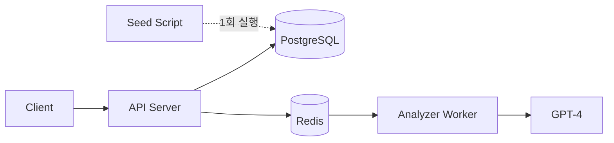

# 투자일기 (Invest Diary)

> AI가 내 투자 판단을 분석해주는 개인 투자일기 시스템

## At a Glance

| Item | Value |
|------|-------|
| Status | 🟡 Development (MVP) |
| Tech Stack | FastAPI, PostgreSQL, Redis, Celery, GPT-4 |
| Service Type | Backend API |

## What is this?

투자일기를 작성하면 AI가 과거 투자 판단의 정확도를 분석해주는 핀테크 서비스입니다.
한국/미국 주식 투자자가 매매 근거와 시장 전망을 기록하고, LLM 기반 피드백을 통해 투자 실력을 향상시킬 수 있습니다.

## Key Features

- ✅ Google OAuth 소셜 로그인
- ✅ 포트폴리오 관리 (한국/미국 주식)
- ✅ 투자일기 작성 + 매매기록 자동 계산
- ✅ AI 기반 투자 판단 분석 (GPT-4)
- ✅ 사용자 자체 분석 vs AI 분석 비교
- ✅ SSE 기반 실시간 분석 결과 전달

## Architecture

| Layer | Technology |
|-------|------------|
| Backend | FastAPI (Python 3.11) + SQLAlchemy 2.0 async |
| Database | PostgreSQL 15, Redis |
| Async Tasks | Celery |
| AI | OpenAI GPT-4 (인터페이스 추상화) |
| Auth | Google OAuth2 + JWT |
| Infra | Docker, Kubernetes |

## Core Workflow

1. **포트폴리오 등록**: 보유 종목, 수량, 평균매수가 입력
2. **투자일기 작성**: 매매 근거와 시장 전망 기록 (매매기록 자동 계산)
3. **분석 요청**: 과거 일기에 대해 분석 요청
4. **AI 분석**: 시장 데이터(주가, 경제지표, 뉴스) + 일기 → GPT-4 분석
5. **결과 수신**: SSE로 실시간 점수, 판정, 개선 제안 수신

## Data Coverage

**시장 데이터 (Pre-seeded 90일)**:
- 한국: KOSPI/KOSDAQ + 주요 15종목 (삼성전자, SK하이닉스, 현대차 등)
- 미국: S&P500/NASDAQ + 주요 15종목 (AAPL, MSFT, GOOGL 등)
- 경제지표: 한국/미국 금리, VIX, 환율, 유가, CPI 등
- 뉴스: 네이버 검색 API, Google News RSS

## API Highlights

| Endpoint | Method | Description |
|----------|--------|-------------|
| /api/v1/auth/login | GET | Google OAuth 로그인 |
| /api/v1/portfolios | POST | 포트폴리오 생성 |
| /api/v1/diaries | POST | 투자일기 작성 |
| /api/v1/analysis | POST | 분석 요청 |
| /api/v1/analysis/{id}/stream | GET | 분석 결과 SSE 스트림 |

## MVP Scope

**In Scope**:
- Google 소셜 로그인
- 포트폴리오 CRUD (수동 입력)
- 투자일기 작성 (매매기록 자동 계산)
- LLM 기반 투자일기 분석 (사용자 요청 시)
- 분석 결과 SSE 실시간 전달

**Out of Scope**:
- 실시간 데이터 수집 (Pre-seeded 90일 데이터 사용)
- 카카오/네이버 소셜 로그인
- 고정 n일 후 자동 분석
- 증권사 API 연동

## Learn More

| Doc | What's inside |
|-----|---------------|
| [Requirements](requirements.md) | 기능 요구사항, 분석 프레임워크, 에러 정책, 데이터 계약 |
| [Architecture](architect.md) | 상세 설계, API 명세, DB 스키마, 시퀀스 다이어그램, 구현 계획 |

---
*Generated by archflow /overview*
