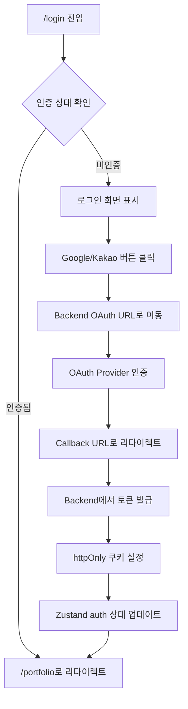
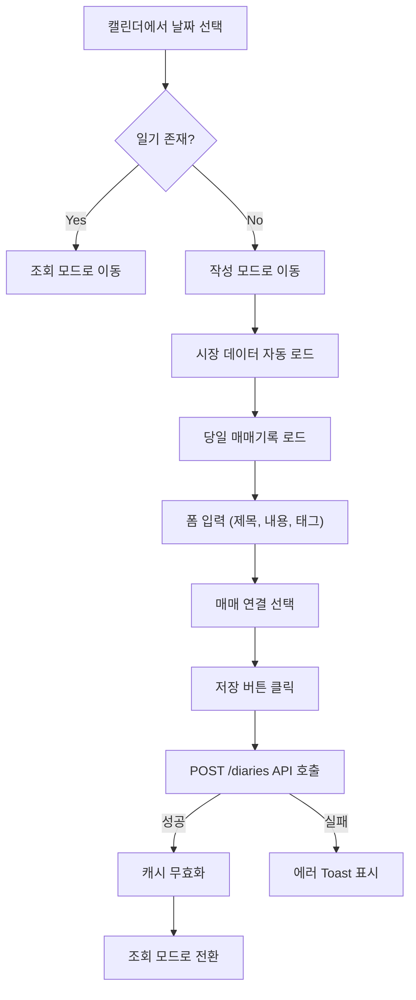

# Frontend Design Doc: 투자일기

> Created: 2026-02-05
> Service: invest-diary
> Type: Frontend
> Requirements: docs/invest-diary/spec.md
> UI Specification: docs/invest-diary/ui.md

## 0. Summary

### Goal
투자자가 자신의 매매 기록과 판단 근거를 체계적으로 기록하고, AI 분석을 통해 과거 판단의 정확도를 평가받을 수 있는 반응형 웹 애플리케이션 구현

### Non-goals
- 네이티브 모바일 앱 (PWA로 대체 가능)
- 실시간 주가 스트리밍 (MVP: Mock 데이터)
- 커뮤니티/소셜 기능

### Success metrics
- 페이지 로드 시간 < 3초 (LCP)
- 번들 사이즈 < 500KB (초기 로드)
- WCAG 2.1 AA 접근성 준수
- OAuth 로그인 성공률 > 99%

---

## 1. Scope

### In scope
- OAuth 소셜 로그인 (Google, Kakao)
- 포트폴리오 CRUD (국내/미국 주식)
- 매매기록 조회 (필터링, 페이지네이션)
- 투자일기 캘린더 뷰 및 작성/수정
- 시장 데이터 표시 (Mock 데이터)
- AI 분석 요청 및 결과 조회
- 반응형 디자인 (Mobile First)

### Out of scope
- 증권사 API 연동 (Post-MVP)
- 자체 분석 작성 및 비교 (Post-MVP)
- 고정일 자동 분석 알림 (Post-MVP)
- 다국어 지원 (한국어 only)

---

## 1.5. Tech Stack

```yaml
tech_stack:
  framework: "Next.js 14 (App Router)"
  language: "TypeScript 5.x"
  state_management: "TanStack Query v5 + Zustand v4"
  styling: "Tailwind CSS v3"
  ui_components: "shadcn/ui"
  routing: "Next.js App Router"
  api_client: "fetch + TanStack Query"
  form_handling: "react-hook-form v7 + zod"
  build_tool: "Next.js (Turbopack dev)"
  testing: "Vitest + Testing Library + Playwright"
  third_party:
    - "date-fns"           # 날짜 처리
    - "chart.js"           # 분석 차트
    - "lucide-react"       # 아이콘
```

---

## 1.6. Dependencies

```yaml
package_manager: "npm"
project_type: "new"

dependencies:
  # Core Framework
  - name: "next"
    version: "14.x"
    purpose: "React 프레임워크 (App Router)"
    status: "approved"
  
  - name: "react"
    version: "18.x"
    purpose: "UI 라이브러리"
    status: "approved"
  
  - name: "typescript"
    version: "5.x"
    purpose: "타입 안전성"
    status: "approved"

  # State Management
  - name: "@tanstack/react-query"
    version: "5.x"
    purpose: "서버 상태 관리 (API 캐싱)"
    status: "approved"
  
  - name: "zustand"
    version: "4.x"
    purpose: "클라이언트 상태 관리 (인증, UI)"
    status: "approved"

  # UI/Styling
  - name: "tailwindcss"
    version: "3.x"
    purpose: "유틸리티 CSS"
    status: "approved"
  
  - name: "class-variance-authority"
    version: "latest"
    purpose: "shadcn/ui 의존성"
    status: "approved"
  
  - name: "clsx"
    version: "latest"
    purpose: "조건부 클래스 병합"
    status: "approved"
  
  - name: "tailwind-merge"
    version: "latest"
    purpose: "Tailwind 클래스 병합"
    status: "approved"
  
  - name: "next-themes"
    version: "^0.3.0"
    purpose: "다크모드 지원"
    status: "approved"

  - name: "lucide-react"
    version: "latest"
    purpose: "아이콘"
    status: "approved"

  # Form & Validation
  - name: "react-hook-form"
    version: "7.x"
    purpose: "폼 상태 관리"
    status: "approved"
  
  - name: "zod"
    version: "3.x"
    purpose: "스키마 검증"
    status: "approved"
  
  - name: "@hookform/resolvers"
    version: "latest"
    purpose: "zod + react-hook-form 통합"
    status: "approved"

  # Date & Charts
  - name: "date-fns"
    version: "3.x"
    purpose: "날짜 처리"
    status: "approved"
  
  - name: "chart.js"
    version: "4.x"
    purpose: "차트 렌더링"
    status: "approved"
  
  - name: "react-chartjs-2"
    version: "5.x"
    purpose: "Chart.js React 래퍼"
    status: "approved"

  # Testing (devDependencies)
  - name: "vitest"
    version: "latest"
    purpose: "단위/통합 테스트"
    status: "approved"
  
  - name: "@testing-library/react"
    version: "latest"
    purpose: "컴포넌트 테스트"
    status: "approved"
  
  - name: "playwright"
    version: "latest"
    purpose: "E2E 테스트"
    status: "approved"
  
  - name: "msw"
    version: "2.x"
    purpose: "API 모킹"
    status: "approved"
```

---

## 2. Architecture Impact

### Component Structure

> **Reference**: ui.md의 화면 목록 및 공통 컴포넌트 기반

```yaml
component_structure:
  # === App Layer (Pages) ===
  pages:
    - path: "/login"
      component: "LoginPage"
      file: "src/app/(auth)/login/page.tsx"
      description: "OAuth 소셜 로그인"
      auth_required: false

    - path: "/auth/callback"
      component: "OAuthCallbackPage"
      file: "src/app/(auth)/auth/callback/page.tsx"
      description: "OAuth 콜백 처리"
      auth_required: false

    - path: "/portfolio"
      component: "PortfolioPage"
      file: "src/app/(main)/portfolio/page.tsx"
      description: "포트폴리오 목록 (Home)"
      auth_required: true

    - path: "/trades"
      component: "TradesPage"
      file: "src/app/(main)/trades/page.tsx"
      description: "매매기록 히스토리"
      auth_required: true

    - path: "/diaries"
      component: "DiaryCalendarPage"
      file: "src/app/(main)/diaries/page.tsx"
      description: "투자일기 캘린더"
      auth_required: true

    - path: "/diaries/[date]"
      component: "DiaryDetailPage"
      file: "src/app/(main)/diaries/[date]/page.tsx"
      description: "일기 상세/작성"
      auth_required: true

    - path: "/analysis"
      component: "AnalysisHistoryPage"
      file: "src/app/(main)/analysis/page.tsx"
      description: "분석 히스토리"
      auth_required: true

    - path: "/analysis/[id]"
      component: "AnalysisDetailPage"
      file: "src/app/(main)/analysis/[id]/page.tsx"
      description: "분석 결과 상세"
      auth_required: true

  # === Features Layer ===
  features:
    - name: "auth"
      path: "src/features/auth/"
      components:
        - name: "SocialLoginButton"
          type: "presentational"
          description: "OAuth 로그인 버튼 (Google/Kakao)"
        - name: "AuthProvider"
          type: "container"
          description: "인증 상태 컨텍스트"
      hooks:
        - "useAuth"
        - "useLogout"

    - name: "portfolio"
      path: "src/features/portfolio/"
      components:
        - name: "PortfolioSummaryCard"
          type: "presentational"
          description: "총 자산 요약 카드"
        - name: "AssetList"
          type: "container"
          description: "자산 목록 (fetching + rendering)"
        - name: "AssetCard"
          type: "presentational"
          description: "개별 자산 카드"
        - name: "AddAssetModal"
          type: "container"
          description: "자산 추가 모달"
        - name: "EditAssetModal"
          type: "container"
          description: "자산 수정 모달"
      hooks:
        - "usePortfolioAssets"
        - "usePortfolioSummary"
        - "useAssetMutation"

    - name: "trades"
      path: "src/features/trades/"
      components:
        - name: "TradeList"
          type: "container"
          description: "매매기록 목록"
        - name: "TradeCard"
          type: "presentational"
          description: "개별 매매 카드"
        - name: "TradeFilter"
          type: "container"
          description: "필터 컨트롤"
      hooks:
        - "useTrades"

    - name: "diary"
      path: "src/features/diary/"
      components:
        - name: "DiaryCalendar"
          type: "container"
          description: "월별 캘린더"
        - name: "DayCell"
          type: "presentational"
          description: "캘린더 날짜 셀"
        - name: "DiaryPreviewCard"
          type: "presentational"
          description: "선택 날짜 미리보기"
        - name: "DiaryForm"
          type: "container"
          description: "일기 작성/수정 폼"
        - name: "DiaryView"
          type: "presentational"
          description: "일기 조회 뷰"
        - name: "MarketSnapshotSection"
          type: "container"
          description: "시장 데이터 표시"
        - name: "TradeLinkSelector"
          type: "container"
          description: "매매 연결 선택"
      hooks:
        - "useDiaries"
        - "useDiaryByDate"
        - "useDiaryMutation"
        - "useMarketSnapshot"

    - name: "analysis"
      path: "src/features/analysis/"
      components:
        - name: "AnalysisList"
          type: "container"
          description: "분석 결과 목록"
        - name: "AnalysisCard"
          type: "presentational"
          description: "분석 카드"
        - name: "AnalysisDetail"
          type: "container"
          description: "분석 상세 뷰"
        - name: "ScoreGauge"
          type: "presentational"
          description: "종합 점수 원형 차트"
        - name: "ScoreBreakdown"
          type: "presentational"
          description: "세부 점수 바"
        - name: "AIFeedbackSection"
          type: "presentational"
          description: "AI 피드백 표시"
        - name: "RequestAnalysisModal"
          type: "container"
          description: "분석 요청 모달"
      hooks:
        - "useAnalysisResults"
        - "useAnalysisDetail"
        - "useAnalysisRequest"

    - name: "market"
      path: "src/features/market/"
      components:
        - name: "StockSearchInput"
          type: "container"
          description: "종목 검색 자동완성"
        - name: "IndexDisplay"
          type: "presentational"
          description: "지수 표시"
      hooks:
        - "useStockSearch"

  # === Entities Layer ===
  entities:
    - name: "user"
      path: "src/entities/user/"
      description: "사용자 엔티티"
      types:
        - "User"
        - "AuthTokens"

    - name: "asset"
      path: "src/entities/asset/"
      description: "보유 자산 엔티티"
      types:
        - "Asset"
        - "AssetSummary"
        - "Market"

    - name: "trade"
      path: "src/entities/trade/"
      description: "매매기록 엔티티"
      types:
        - "Trade"
        - "TradeType"

    - name: "diary"
      path: "src/entities/diary/"
      description: "투자일기 엔티티"
      types:
        - "Diary"
        - "DiaryPreview"
        - "MarketSnapshot"

    - name: "analysis"
      path: "src/entities/analysis/"
      description: "분석 결과 엔티티"
      types:
        - "AnalysisResult"
        - "AnalysisScores"

  # === Shared Layer ===
  shared:
    - name: "AppShell"
      path: "src/shared/layout/app-shell.tsx"
      props:
        - name: "children"
          type: "ReactNode"
          required: true
      description: "메인 레이아웃 (헤더 + 컨텐츠 + 네비게이션)"

    - name: "Header"
      path: "src/shared/layout/header.tsx"
      props:
        - name: "title"
          type: "string"
          required: false
        - name: "showBack"
          type: "boolean"
          required: false
        - name: "actions"
          type: "ReactNode"
          required: false
      description: "상단 헤더"

    - name: "BottomNav"
      path: "src/shared/layout/bottom-nav.tsx"
      description: "모바일 하단 네비게이션"

    - name: "Sidebar"
      path: "src/shared/layout/sidebar.tsx"
      description: "데스크톱 사이드바"

    - name: "LoadingSpinner"
      path: "src/shared/ui/loading-spinner.tsx"
      description: "로딩 스피너"

    - name: "EmptyState"
      path: "src/shared/ui/empty-state.tsx"
      props:
        - name: "icon"
          type: "LucideIcon"
          required: false
        - name: "title"
          type: "string"
          required: true
        - name: "description"
          type: "string"
          required: false
        - name: "action"
          type: "ReactNode"
          required: false
      description: "빈 상태 UI"

    - name: "ErrorState"
      path: "src/shared/ui/error-state.tsx"
      props:
        - name: "error"
          type: "Error"
          required: true
        - name: "onRetry"
          type: "() => void"
          required: false
      description: "에러 상태 UI"

    - name: "SkeletonCard"
      path: "src/shared/ui/skeleton-card.tsx"
      description: "스켈레톤 로딩 카드"
```

### File Structure

```
invest-diary-web/
├── src/
│   ├── app/                              # Next.js App Router
│   │   ├── (auth)/                       # 인증 불필요 그룹
│   │   │   ├── login/
│   │   │   │   └── page.tsx
│   │   │   └── auth/
│   │   │       └── callback/
│   │   │           └── page.tsx
│   │   ├── (main)/                       # 인증 필요 그룹
│   │   │   ├── layout.tsx                # AppShell 래퍼
│   │   │   ├── portfolio/
│   │   │   │   └── page.tsx
│   │   │   ├── trades/
│   │   │   │   └── page.tsx
│   │   │   ├── diaries/
│   │   │   │   ├── page.tsx
│   │   │   │   └── [date]/
│   │   │   │       └── page.tsx
│   │   │   └── analysis/
│   │   │       ├── page.tsx
│   │   │       └── [id]/
│   │   │           └── page.tsx
│   │   ├── layout.tsx                    # Root layout (providers)
│   │   ├── error.tsx                     # Global error boundary
│   │   ├── loading.tsx                   # Global loading
│   │   └── not-found.tsx                 # 404
│   │
│   ├── features/                         # Feature modules
│   │   ├── auth/
│   │   │   ├── components/
│   │   │   │   ├── social-login-button.tsx
│   │   │   │   └── auth-provider.tsx
│   │   │   ├── hooks/
│   │   │   │   ├── use-auth.ts
│   │   │   │   └── use-logout.ts
│   │   │   └── index.ts
│   │   ├── portfolio/
│   │   │   ├── components/
│   │   │   │   ├── portfolio-summary-card.tsx
│   │   │   │   ├── asset-list.tsx
│   │   │   │   ├── asset-card.tsx
│   │   │   │   ├── add-asset-modal.tsx
│   │   │   │   └── edit-asset-modal.tsx
│   │   │   ├── hooks/
│   │   │   │   ├── use-portfolio-assets.ts
│   │   │   │   ├── use-portfolio-summary.ts
│   │   │   │   └── use-asset-mutation.ts
│   │   │   └── index.ts
│   │   ├── trades/
│   │   │   ├── components/
│   │   │   │   ├── trade-list.tsx
│   │   │   │   ├── trade-card.tsx
│   │   │   │   └── trade-filter.tsx
│   │   │   ├── hooks/
│   │   │   │   └── use-trades.ts
│   │   │   └── index.ts
│   │   ├── diary/
│   │   │   ├── components/
│   │   │   │   ├── diary-calendar.tsx
│   │   │   │   ├── day-cell.tsx
│   │   │   │   ├── diary-preview-card.tsx
│   │   │   │   ├── diary-form.tsx
│   │   │   │   ├── diary-view.tsx
│   │   │   │   ├── market-snapshot-section.tsx
│   │   │   │   └── trade-link-selector.tsx
│   │   │   ├── hooks/
│   │   │   │   ├── use-diaries.ts
│   │   │   │   ├── use-diary-by-date.ts
│   │   │   │   ├── use-diary-mutation.ts
│   │   │   │   └── use-market-snapshot.ts
│   │   │   └── index.ts
│   │   ├── analysis/
│   │   │   ├── components/
│   │   │   │   ├── analysis-list.tsx
│   │   │   │   ├── analysis-card.tsx
│   │   │   │   ├── analysis-detail.tsx
│   │   │   │   ├── score-gauge.tsx
│   │   │   │   ├── score-breakdown.tsx
│   │   │   │   ├── ai-feedback-section.tsx
│   │   │   │   └── request-analysis-modal.tsx
│   │   │   ├── hooks/
│   │   │   │   ├── use-analysis-results.ts
│   │   │   │   ├── use-analysis-detail.ts
│   │   │   │   └── use-analysis-request.ts
│   │   │   └── index.ts
│   │   └── market/
│   │       ├── components/
│   │       │   ├── stock-search-input.tsx
│   │       │   └── index-display.tsx
│   │       ├── hooks/
│   │       │   └── use-stock-search.ts
│   │       └── index.ts
│   │
│   ├── entities/                         # Domain entities
│   │   ├── user/
│   │   │   └── types.ts
│   │   ├── asset/
│   │   │   └── types.ts
│   │   ├── trade/
│   │   │   └── types.ts
│   │   ├── diary/
│   │   │   └── types.ts
│   │   └── analysis/
│   │       └── types.ts
│   │
│   ├── shared/                           # Shared layer
│   │   ├── api/
│   │   │   ├── client.ts                 # API 클라이언트 (fetch wrapper)
│   │   │   ├── endpoints.ts              # 엔드포인트 정의
│   │   │   └── query-keys.ts             # TanStack Query 키 팩토리
│   │   ├── auth/
│   │   │   ├── token-manager.ts          # 토큰 관리 (cookies)
│   │   │   └── middleware.ts             # 인증 미들웨어 로직
│   │   ├── layout/
│   │   │   ├── app-shell.tsx
│   │   │   ├── header.tsx
│   │   │   ├── bottom-nav.tsx
│   │   │   └── sidebar.tsx
│   │   ├── ui/                           # shadcn/ui components
│   │   │   ├── button.tsx
│   │   │   ├── card.tsx
│   │   │   ├── dialog.tsx
│   │   │   ├── dropdown-menu.tsx
│   │   │   ├── form.tsx
│   │   │   ├── input.tsx
│   │   │   ├── calendar.tsx
│   │   │   ├── command.tsx               # Autocomplete
│   │   │   ├── toast.tsx
│   │   │   ├── theme-toggle.tsx          # 다크모드 토글
│   │   │   └── ...
│   │   ├── lib/
│   │   │   ├── cn.ts                     # classnames utility
│   │   │   ├── format.ts                 # 포맷 유틸리티
│   │   │   └── validation.ts             # 공통 zod 스키마
│   │   ├── hooks/
│   │   │   ├── use-media-query.ts
│   │   │   └── use-toast.ts
│   │   └── constants.ts
│   │
│   ├── stores/                           # Zustand stores
│   │   ├── auth-store.ts
│   │   └── ui-store.ts
│   │
│   └── providers/                        # React providers
│       ├── query-provider.tsx
│       ├── theme-provider.tsx            # 다크모드 ThemeProvider
│       └── toast-provider.tsx
│
├── public/
│   └── icons/
├── middleware.ts                         # Next.js 미들웨어 (라우트 가드)
├── next.config.js
├── tailwind.config.ts
├── tsconfig.json
├── vitest.config.ts
├── playwright.config.ts
└── package.json
```

---

## 3. State Management

```yaml
state_management:
  global_state:                           # Zustand
    - name: "authStore"
      file: "src/stores/auth-store.ts"
      state:
        - field: "user"
          type: "User | null"
          initial: "null"
        - field: "isAuthenticated"
          type: "boolean"
          initial: "false"
        - field: "isLoading"
          type: "boolean"
          initial: "true"
      actions:
        - name: "setUser"
          description: "사용자 정보 설정"
        - name: "logout"
          description: "로그아웃 (상태 초기화)"
        - name: "setLoading"
          description: "로딩 상태 변경"
      selectors:
        - name: "useIsAuthenticated"
          returns: "boolean"
        - name: "useCurrentUser"
          returns: "User | null"

    - name: "uiStore"
      file: "src/stores/ui-store.ts"
      state:
        - field: "sidebarOpen"
          type: "boolean"
          initial: "false"
        - field: "selectedDate"
          type: "Date | null"
          initial: "null"
      actions:
        - name: "toggleSidebar"
          description: "사이드바 토글"
        - name: "setSelectedDate"
          description: "캘린더 선택 날짜"

  server_state:                           # TanStack Query
    - query_key: "['portfolio', 'assets']"
      endpoint: "GET /api/v1/portfolio/assets"
      stale_time: "30s"
      cache_time: "5min"

    - query_key: "['portfolio', 'summary']"
      endpoint: "GET /api/v1/portfolio/summary"
      stale_time: "30s"
      cache_time: "5min"

    - query_key: "['trades', filters]"
      endpoint: "GET /api/v1/trades"
      stale_time: "1min"
      cache_time: "5min"

    - query_key: "['diaries', { year, month }]"
      endpoint: "GET /api/v1/diaries"
      stale_time: "1min"
      cache_time: "10min"

    - query_key: "['diary', date]"
      endpoint: "GET /api/v1/diaries/{date}"
      stale_time: "30s"
      cache_time: "5min"

    - query_key: "['market', 'snapshot', date]"
      endpoint: "GET /api/v1/market/snapshot/{date}"
      stale_time: "5min"
      cache_time: "1hour"

    - query_key: "['market', 'search', query]"
      endpoint: "GET /api/v1/market/stocks/search"
      stale_time: "0"
      cache_time: "1min"

    - query_key: "['analysis', 'results', page]"
      endpoint: "GET /api/v1/analysis/results"
      stale_time: "1min"
      cache_time: "5min"

    - query_key: "['analysis', id]"
      endpoint: "GET /api/v1/analysis/results/{id}"
      stale_time: "5min"
      cache_time: "30min"

  local_state:
    - component: "AddAssetModal"
      states:
        - name: "isOpen"
          type: "boolean"
          purpose: "모달 열림 상태"
        - name: "searchQuery"
          type: "string"
          purpose: "종목 검색어"

    - component: "DiaryForm"
      states:
        - name: "isDirty"
          type: "boolean"
          purpose: "폼 변경 여부 (이탈 방지)"

    - component: "TradeFilter"
      states:
        - name: "localFilters"
          type: "TradeFilters"
          purpose: "적용 전 필터 상태"
```

---

## 4. Route Definition

```yaml
routes:
  # === Public Routes ===
  - path: "/login"
    component: "LoginPage"
    auth_required: false
    redirect_if_authenticated: "/portfolio"

  - path: "/auth/callback"
    component: "OAuthCallbackPage"
    auth_required: false

  # === Protected Routes ===
  - path: "/portfolio"
    component: "PortfolioPage"
    auth_required: true
    guards:
      - "AuthGuard"

  - path: "/trades"
    component: "TradesPage"
    auth_required: true
    guards:
      - "AuthGuard"

  - path: "/diaries"
    component: "DiaryCalendarPage"
    auth_required: true
    guards:
      - "AuthGuard"

  - path: "/diaries/:date"
    component: "DiaryDetailPage"
    auth_required: true
    params:
      - name: "date"
        type: "string"
        format: "YYYY-MM-DD"
    guards:
      - "AuthGuard"

  - path: "/analysis"
    component: "AnalysisHistoryPage"
    auth_required: true
    guards:
      - "AuthGuard"

  - path: "/analysis/:id"
    component: "AnalysisDetailPage"
    auth_required: true
    params:
      - name: "id"
        type: "string"
        format: "uuid"
    guards:
      - "AuthGuard"

  # === Catch-all ===
  - path: "*"
    component: "NotFoundPage"
    exact: false
```

### Auth Guard Implementation

```typescript
// middleware.ts
import { NextResponse } from 'next/server';
import type { NextRequest } from 'next/server';

const publicPaths = ['/login', '/auth/callback'];
const protectedPaths = ['/portfolio', '/trades', '/diaries', '/analysis'];

export function middleware(request: NextRequest) {
  const { pathname } = request.nextUrl;
  
  // Check if path requires auth
  const isProtected = protectedPaths.some(p => pathname.startsWith(p));
  const isPublic = publicPaths.some(p => pathname.startsWith(p));
  
  // Get auth cookie
  const accessToken = request.cookies.get('access_token')?.value;
  
  if (isProtected && !accessToken) {
    // Redirect to login with return URL
    const loginUrl = new URL('/login', request.url);
    loginUrl.searchParams.set('redirect', pathname);
    return NextResponse.redirect(loginUrl);
  }
  
  if (isPublic && accessToken && pathname === '/login') {
    // Already authenticated, redirect to home
    return NextResponse.redirect(new URL('/portfolio', request.url));
  }
  
  return NextResponse.next();
}

export const config = {
  matcher: ['/((?!api|_next/static|_next/image|favicon.ico).*)'],
};
```

---

## 5. API Integration

### API Client Configuration

```yaml
api_client:
  base_url: "${NEXT_PUBLIC_API_URL}/api/v1"
  timeout: 30000
  credentials: "include"                  # httpOnly cookies
  headers:
    - name: "Content-Type"
      value: "application/json"
  interceptors:
    request:
      - "addRequestId"                    # 요청 추적용 ID
    response:
      - "handleUnauthorized"              # 401 → 토큰 갱신 또는 로그아웃
      - "transformError"                  # 에러 형식 변환
```

### API Endpoints (Reference from arch-be.md)

```yaml
api_integration:
  # === Auth ===
  - endpoint: "GET /auth/google"
    description: "Google OAuth 시작"
    hook: null
    action: "window.location.href = url"

  - endpoint: "GET /auth/kakao"
    description: "Kakao OAuth 시작"
    hook: null
    action: "window.location.href = url"

  - endpoint: "GET /auth/google/callback"
    description: "Google OAuth 콜백"
    hook: null
    action: "서버 처리 (쿠키 설정)"

  - endpoint: "POST /auth/refresh"
    description: "토큰 갱신"
    hook: null
    action: "자동 인터셉터 처리"

  - endpoint: "GET /auth/me"
    description: "현재 사용자 조회"
    hook: "useCurrentUser"
    file: "src/features/auth/hooks/use-auth.ts"

  # === Portfolio ===
  - endpoint: "GET /portfolio/assets"
    hook: "usePortfolioAssets"
    file: "src/features/portfolio/hooks/use-portfolio-assets.ts"
    options:
      stale_time: "30s"
      retry: 3

  - endpoint: "GET /portfolio/summary"
    hook: "usePortfolioSummary"
    file: "src/features/portfolio/hooks/use-portfolio-summary.ts"
    options:
      stale_time: "30s"

  - endpoint: "POST /portfolio/assets"
    hook: "useCreateAsset"
    file: "src/features/portfolio/hooks/use-asset-mutation.ts"
    invalidates:
      - "['portfolio', 'assets']"
      - "['portfolio', 'summary']"

  - endpoint: "PUT /portfolio/assets/{id}"
    hook: "useUpdateAsset"
    file: "src/features/portfolio/hooks/use-asset-mutation.ts"
    invalidates:
      - "['portfolio', 'assets']"
      - "['portfolio', 'summary']"
      - "['trades']"

  - endpoint: "DELETE /portfolio/assets/{id}"
    hook: "useDeleteAsset"
    file: "src/features/portfolio/hooks/use-asset-mutation.ts"
    invalidates:
      - "['portfolio', 'assets']"
      - "['portfolio', 'summary']"
      - "['trades']"

  # === Trades ===
  - endpoint: "GET /trades"
    hook: "useTrades"
    file: "src/features/trades/hooks/use-trades.ts"
    options:
      stale_time: "1min"

  # === Diaries ===
  - endpoint: "GET /diaries"
    hook: "useDiaries"
    file: "src/features/diary/hooks/use-diaries.ts"
    options:
      stale_time: "1min"

  - endpoint: "GET /diaries/{date}"
    hook: "useDiaryByDate"
    file: "src/features/diary/hooks/use-diary-by-date.ts"

  - endpoint: "POST /diaries"
    hook: "useCreateDiary"
    file: "src/features/diary/hooks/use-diary-mutation.ts"
    invalidates:
      - "['diaries']"

  - endpoint: "PUT /diaries/{date}"
    hook: "useUpdateDiary"
    file: "src/features/diary/hooks/use-diary-mutation.ts"
    invalidates:
      - "['diaries']"
      - "['diary', date]"

  # === Market ===
  - endpoint: "GET /market/snapshot/{date}"
    hook: "useMarketSnapshot"
    file: "src/features/diary/hooks/use-market-snapshot.ts"
    options:
      stale_time: "5min"

  - endpoint: "GET /market/stocks/search"
    hook: "useStockSearch"
    file: "src/features/market/hooks/use-stock-search.ts"
    options:
      enabled: "query.length >= 2"
      debounce: "300ms"

  # === Analysis ===
  - endpoint: "GET /analysis/results"
    hook: "useAnalysisResults"
    file: "src/features/analysis/hooks/use-analysis-results.ts"

  - endpoint: "GET /analysis/results/{id}"
    hook: "useAnalysisDetail"
    file: "src/features/analysis/hooks/use-analysis-detail.ts"

  - endpoint: "POST /analysis/request"
    hook: "useAnalysisRequest"
    file: "src/features/analysis/hooks/use-analysis-request.ts"
    invalidates:
      - "['analysis', 'results']"
```

---

## 6. Code Mapping

| # | Spec Ref | Feature | File | Component/Hook | Props/Params | Action | Impl |
|---|----------|---------|------|----------------|--------------|--------|------|
| 1 | FR-001 | OAuth 로그인 | `src/app/(auth)/login/page.tsx` | `LoginPage` | - | OAuth 리다이렉트 | [ ] |
| 2 | FR-001 | OAuth 콜백 | `src/app/(auth)/auth/callback/page.tsx` | `OAuthCallbackPage` | `code`, `provider` | 토큰 처리 후 리다이렉트 | [ ] |
| 3 | FR-001 | 로그인 버튼 | `src/features/auth/components/social-login-button.tsx` | `SocialLoginButton` | `provider: 'google' \| 'kakao'` | OAuth URL로 이동 | [ ] |
| 4 | FR-001 | 인증 상태 | `src/features/auth/hooks/use-auth.ts` | `useAuth` | - | 사용자 정보 조회 | [ ] |
| 5 | FR-002 | 포트폴리오 페이지 | `src/app/(main)/portfolio/page.tsx` | `PortfolioPage` | - | 자산 목록 표시 | [ ] |
| 6 | FR-002 | 요약 카드 | `src/features/portfolio/components/portfolio-summary-card.tsx` | `PortfolioSummaryCard` | `summary: AssetSummary` | 총 자산/수익률 표시 | [ ] |
| 7 | FR-002 | 자산 목록 | `src/features/portfolio/components/asset-list.tsx` | `AssetList` | - | 자산 카드 렌더링 | [ ] |
| 8 | FR-002 | 자산 카드 | `src/features/portfolio/components/asset-card.tsx` | `AssetCard` | `asset: Asset` | 개별 자산 표시 | [ ] |
| 9 | FR-002 | 자산 추가 | `src/features/portfolio/components/add-asset-modal.tsx` | `AddAssetModal` | `open`, `onClose` | 자산 추가 폼 | [ ] |
| 10 | FR-002 | 자산 수정 | `src/features/portfolio/components/edit-asset-modal.tsx` | `EditAssetModal` | `asset`, `open`, `onClose` | 자산 수정/삭제 | [ ] |
| 11 | FR-003 | 종목 검색 | `src/features/market/components/stock-search-input.tsx` | `StockSearchInput` | `onSelect`, `market?` | 자동완성 검색 | [ ] |
| 12 | FR-004 | 매매기록 페이지 | `src/app/(main)/trades/page.tsx` | `TradesPage` | - | 매매 히스토리 | [ ] |
| 13 | FR-004 | 매매 목록 | `src/features/trades/components/trade-list.tsx` | `TradeList` | - | 날짜별 그룹 렌더링 | [ ] |
| 14 | FR-004 | 매매 카드 | `src/features/trades/components/trade-card.tsx` | `TradeCard` | `trade: Trade` | 개별 매매 표시 | [ ] |
| 15 | FR-004 | 필터 | `src/features/trades/components/trade-filter.tsx` | `TradeFilter` | `filters`, `onChange` | 필터 컨트롤 | [ ] |
| 16 | FR-005 | 일기 캘린더 | `src/app/(main)/diaries/page.tsx` | `DiaryCalendarPage` | - | 월별 캘린더 | [ ] |
| 17 | FR-005 | 캘린더 컴포넌트 | `src/features/diary/components/diary-calendar.tsx` | `DiaryCalendar` | `diaries`, `onDateSelect` | 날짜 셀 렌더링 | [ ] |
| 18 | FR-005 | 미리보기 | `src/features/diary/components/diary-preview-card.tsx` | `DiaryPreviewCard` | `diary: DiaryPreview` | 선택 날짜 미리보기 | [ ] |
| 19 | FR-005 | 일기 상세 | `src/app/(main)/diaries/[date]/page.tsx` | `DiaryDetailPage` | `params.date` | 조회/작성 모드 | [ ] |
| 20 | FR-005 | 일기 폼 | `src/features/diary/components/diary-form.tsx` | `DiaryForm` | `date`, `diary?`, `trades` | 작성/수정 폼 | [ ] |
| 21 | FR-005 | 일기 뷰 | `src/features/diary/components/diary-view.tsx` | `DiaryView` | `diary: Diary` | 읽기 전용 뷰 | [ ] |
| 22 | FR-005 | 매매 연결 | `src/features/diary/components/trade-link-selector.tsx` | `TradeLinkSelector` | `trades`, `selected`, `onChange` | 체크박스 목록 | [ ] |
| 23 | FR-006 | 시장 데이터 | `src/features/diary/components/market-snapshot-section.tsx` | `MarketSnapshotSection` | `date` | 지수/VIX 표시 | [ ] |
| 24 | FR-008 | 분석 요청 모달 | `src/features/analysis/components/request-analysis-modal.tsx` | `RequestAnalysisModal` | `diaryId`, `open`, `onClose` | 기간 선택 + 요청 | [ ] |
| 25 | FR-010 | 종합 점수 | `src/features/analysis/components/score-gauge.tsx` | `ScoreGauge` | `score: number` | 도넛 차트 | [ ] |
| 26 | FR-010 | 세부 점수 | `src/features/analysis/components/score-breakdown.tsx` | `ScoreBreakdown` | `scores: AnalysisScores` | 막대 차트 | [ ] |
| 27 | FR-013 | 분석 히스토리 | `src/app/(main)/analysis/page.tsx` | `AnalysisHistoryPage` | - | 분석 목록 | [ ] |
| 28 | FR-013 | 분석 목록 | `src/features/analysis/components/analysis-list.tsx` | `AnalysisList` | - | 카드 렌더링 | [ ] |
| 29 | FR-013 | 분석 카드 | `src/features/analysis/components/analysis-card.tsx` | `AnalysisCard` | `analysis` | 개별 분석 | [ ] |
| 30 | FR-013 | 분석 상세 | `src/app/(main)/analysis/[id]/page.tsx` | `AnalysisDetailPage` | `params.id` | 상세 뷰 | [ ] |
| 31 | FR-013 | AI 피드백 | `src/features/analysis/components/ai-feedback-section.tsx` | `AIFeedbackSection` | `feedback: string` | 마크다운 렌더링 | [ ] |
| 32 | - | 레이아웃 | `src/app/(main)/layout.tsx` | `MainLayout` | `children` | AppShell 래퍼 | [ ] |
| 33 | - | 헤더 | `src/shared/layout/header.tsx` | `Header` | `title?`, `showBack?`, `actions?` | 상단 헤더 | [ ] |
| 34 | - | 하단 네비 | `src/shared/layout/bottom-nav.tsx` | `BottomNav` | - | 모바일 네비게이션 | [ ] |
| 35 | - | 사이드바 | `src/shared/layout/sidebar.tsx` | `Sidebar` | - | 데스크톱 사이드바 | [ ] |
| 36 | - | 에러 상태 | `src/shared/ui/error-state.tsx` | `ErrorState` | `error`, `onRetry?` | 에러 UI | [ ] |
| 37 | - | 빈 상태 | `src/shared/ui/empty-state.tsx` | `EmptyState` | `icon?`, `title`, `description?`, `action?` | 빈 상태 UI | [ ] |
| 38 | - | API 클라이언트 | `src/shared/api/client.ts` | `apiClient` | - | fetch 래퍼 | [ ] |
| 39 | - | 쿼리 키 | `src/shared/api/query-keys.ts` | `queryKeys` | - | 키 팩토리 | [ ] |
| 40 | - | 토큰 관리 | `src/shared/auth/token-manager.ts` | `tokenManager` | - | 쿠키 기반 토큰 | [ ] |

---

## 7. Implementation Plan

### Required Reference Files (Must read before implementation)

| File | Reference Purpose |
|------|------------------|
| `docs/invest-diary/ui.md` | 화면별 상세 명세, 컴포넌트 계층, 상태, 인터랙션 |
| `docs/invest-diary/arch-be.md` | API 엔드포인트 스펙, 요청/응답 스키마 |
| `docs/invest-diary/spec.md` | 요구사항 정의, 데이터 검증 규칙 |

### Step-by-Step Implementation

1. **Step 1: 프로젝트 초기화**
   - `npx create-next-app@latest` (App Router, TypeScript)
   - 의존성 설치 (`npm install`)
   - Tailwind CSS + shadcn/ui 설정
   - 폴더 구조 생성

2. **Step 2: 공통 레이어 (Shared)**
   - API 클라이언트 (`client.ts`)
   - 쿼리 키 팩토리 (`query-keys.ts`)
   - 토큰 매니저 (`token-manager.ts`)
   - 레이아웃 컴포넌트 (Header, BottomNav, Sidebar)
   - 공통 UI (EmptyState, ErrorState, LoadingSpinner)
   - Zustand 스토어 (auth, ui)

3. **Step 3: 인증 기능 (Auth)**
   - 로그인 페이지
   - OAuth 콜백 페이지
   - 미들웨어 (라우트 가드)
   - useAuth 훅

4. **Step 4: 포트폴리오 기능**
   - 포트폴리오 페이지
   - 요약 카드, 자산 목록, 자산 카드
   - 자산 추가/수정 모달
   - usePortfolioAssets, useAssetMutation 훅

5. **Step 5: 매매기록 기능**
   - 매매기록 페이지
   - 매매 목록, 매매 카드, 필터
   - useTrades 훅

6. **Step 6: 투자일기 기능**
   - 캘린더 페이지
   - 캘린더 컴포넌트, 날짜 셀
   - 일기 상세 페이지
   - 일기 폼/뷰, 시장 데이터 섹션
   - useDiaries, useDiaryMutation 훅

7. **Step 7: 분석 기능**
   - 분석 히스토리 페이지
   - 분석 목록, 분석 카드
   - 분석 상세 페이지
   - 점수 차트 (ScoreGauge, ScoreBreakdown)
   - 분석 요청 모달
   - useAnalysis 훅

8. **Step 8: 테스트 및 마무리**
   - 단위 테스트 (Vitest)
   - E2E 테스트 (Playwright)
   - 성능 최적화 (코드 스플리팅)
   - 접근성 검토

---

## 8. User Flow Diagram

### OAuth 로그인 플로우



### 일기 작성 플로우



### 분석 요청 플로우

```mermaid
flowchart TD
    A["일기 상세에서 분석 요청 클릭"] --> B["분석 요청 모달 열림"]
    B --> C["분석 기간 선택 (7/14/30/90일)"]
    C --> D["요청 버튼 클릭"]
    D --> E["POST /analysis/request"]
    E -->|성공| F["분석 결과 응답"]
    F --> G["분석 상세 페이지로 이동"]
    E -->|실패 (503)| H["LLM 서비스 오류 Toast"]
    E -->|실패 (400)| I["데이터 부족 오류 Toast"]
```

---

## 9. Style Guide

### Design Tokens

```yaml
design_tokens:
  colors:
    # Light Mode
    light:
      primary: "#2563eb"                  # Blue 600
      primary_hover: "#1d4ed8"            # Blue 700
      success: "#16a34a"                  # Green 600 (매수, 상승)
      danger: "#dc2626"                   # Red 600 (매도, 하락)
      warning: "#ca8a04"                  # Yellow 600
      bg: "#ffffff"
      bg_secondary: "#f9fafb"             # Gray 50
      bg_card: "#ffffff"
      border: "#e5e7eb"                   # Gray 200
      text: "#111827"                     # Gray 900
      text_secondary: "#6b7280"           # Gray 500
    
    # Dark Mode
    dark:
      primary: "#3b82f6"                  # Blue 500 (밝게)
      primary_hover: "#60a5fa"            # Blue 400
      success: "#22c55e"                  # Green 500 (밝게)
      danger: "#ef4444"                   # Red 500 (밝게)
      warning: "#eab308"                  # Yellow 500
      bg: "#0f172a"                       # Slate 900
      bg_secondary: "#1e293b"             # Slate 800
      bg_card: "#1e293b"                  # Slate 800
      border: "#334155"                   # Slate 700
      text: "#f8fafc"                     # Slate 50
      text_secondary: "#94a3b8"           # Slate 400

  spacing:
    unit: "0.25rem"                       # 4px
    scale: [1, 2, 3, 4, 6, 8, 12, 16, 24, 32]

  typography:
    font_family: "'Pretendard', -apple-system, BlinkMacSystemFont, sans-serif"
    sizes:
      xs: "0.75rem"                       # 12px
      sm: "0.875rem"                      # 14px
      base: "1rem"                        # 16px
      lg: "1.125rem"                      # 18px
      xl: "1.25rem"                       # 20px
      2xl: "1.5rem"                       # 24px
      3xl: "1.875rem"                     # 30px

  breakpoints:
    sm: "640px"
    md: "768px"
    lg: "1024px"
    xl: "1280px"
```

### Component Styling Convention

```yaml
styling_convention:
  approach: "Tailwind CSS (utility-first)"
  naming: "shadcn/ui conventions"
  responsive: "mobile-first"
  dark_mode: "supported (next-themes)"
  css_variables: "Yes (design tokens)"
  default_theme: "system"                  # 시스템 설정 따름
```

### Dark Mode Implementation

**패키지:**
```yaml
dependencies:
  - name: "next-themes"
    version: "^0.3.0"
    purpose: "Next.js 다크모드 지원"
```

**ThemeProvider 설정:**
```tsx
// src/providers/theme-provider.tsx
'use client';

import { ThemeProvider as NextThemesProvider } from 'next-themes';
import { type ThemeProviderProps } from 'next-themes/dist/types';

export function ThemeProvider({ children, ...props }: ThemeProviderProps) {
  return (
    <NextThemesProvider
      attribute="class"
      defaultTheme="system"
      enableSystem
      disableTransitionOnChange
      {...props}
    >
      {children}
    </NextThemesProvider>
  );
}
```

**Root Layout 적용:**
```tsx
// src/app/layout.tsx
import { ThemeProvider } from '@/providers/theme-provider';

export default function RootLayout({ children }: { children: React.ReactNode }) {
  return (
    <html lang="ko" suppressHydrationWarning>
      <body>
        <ThemeProvider>
          <QueryProvider>
            {children}
          </QueryProvider>
        </ThemeProvider>
      </body>
    </html>
  );
}
```

**Tailwind 설정:**
```ts
// tailwind.config.ts
import type { Config } from 'tailwindcss';

const config: Config = {
  darkMode: 'class',
  content: ['./src/**/*.{ts,tsx}'],
  theme: {
    extend: {
      colors: {
        background: 'hsl(var(--background))',
        foreground: 'hsl(var(--foreground))',
        card: 'hsl(var(--card))',
        'card-foreground': 'hsl(var(--card-foreground))',
        primary: 'hsl(var(--primary))',
        'primary-foreground': 'hsl(var(--primary-foreground))',
        secondary: 'hsl(var(--secondary))',
        'secondary-foreground': 'hsl(var(--secondary-foreground))',
        muted: 'hsl(var(--muted))',
        'muted-foreground': 'hsl(var(--muted-foreground))',
        border: 'hsl(var(--border))',
        success: 'hsl(var(--success))',
        danger: 'hsl(var(--danger))',
      },
    },
  },
  plugins: [require('tailwindcss-animate')],
};

export default config;
```

**CSS Variables (globals.css):**
```css
/* src/app/globals.css */
@tailwind base;
@tailwind components;
@tailwind utilities;

@layer base {
  :root {
    --background: 0 0% 100%;
    --foreground: 222.2 84% 4.9%;
    --card: 0 0% 100%;
    --card-foreground: 222.2 84% 4.9%;
    --primary: 221.2 83.2% 53.3%;
    --primary-foreground: 210 40% 98%;
    --secondary: 210 40% 96.1%;
    --secondary-foreground: 222.2 47.4% 11.2%;
    --muted: 210 40% 96.1%;
    --muted-foreground: 215.4 16.3% 46.9%;
    --border: 214.3 31.8% 91.4%;
    --success: 142.1 76.2% 36.3%;
    --danger: 0 84.2% 60.2%;
  }

  .dark {
    --background: 222.2 84% 4.9%;
    --foreground: 210 40% 98%;
    --card: 222.2 84% 4.9%;
    --card-foreground: 210 40% 98%;
    --primary: 217.2 91.2% 59.8%;
    --primary-foreground: 222.2 47.4% 11.2%;
    --secondary: 217.2 32.6% 17.5%;
    --secondary-foreground: 210 40% 98%;
    --muted: 217.2 32.6% 17.5%;
    --muted-foreground: 215 20.2% 65.1%;
    --border: 217.2 32.6% 17.5%;
    --success: 142.1 70.6% 45.3%;
    --danger: 0 72.2% 50.6%;
  }
}
```

**테마 토글 컴포넌트:**
```tsx
// src/shared/ui/theme-toggle.tsx
'use client';

import { Moon, Sun } from 'lucide-react';
import { useTheme } from 'next-themes';
import { Button } from '@/shared/ui/button';
import {
  DropdownMenu,
  DropdownMenuContent,
  DropdownMenuItem,
  DropdownMenuTrigger,
} from '@/shared/ui/dropdown-menu';

export function ThemeToggle() {
  const { setTheme } = useTheme();

  return (
    <DropdownMenu>
      <DropdownMenuTrigger asChild>
        <Button variant="ghost" size="icon">
          <Sun className="h-5 w-5 rotate-0 scale-100 transition-all dark:-rotate-90 dark:scale-0" />
          <Moon className="absolute h-5 w-5 rotate-90 scale-0 transition-all dark:rotate-0 dark:scale-100" />
          <span className="sr-only">테마 변경</span>
        </Button>
      </DropdownMenuTrigger>
      <DropdownMenuContent align="end">
        <DropdownMenuItem onClick={() => setTheme('light')}>
          라이트
        </DropdownMenuItem>
        <DropdownMenuItem onClick={() => setTheme('dark')}>
          다크
        </DropdownMenuItem>
        <DropdownMenuItem onClick={() => setTheme('system')}>
          시스템
        </DropdownMenuItem>
      </DropdownMenuContent>
    </DropdownMenu>
  );
}
```

**Header에 테마 토글 배치:**
```tsx
// src/shared/layout/header.tsx (일부)
import { ThemeToggle } from '@/shared/ui/theme-toggle';

export function Header() {
  return (
    <header className="border-b bg-background">
      <div className="flex h-14 items-center justify-between px-4">
        <Logo />
        <div className="flex items-center gap-2">
          <ThemeToggle />
          <UserMenu />
        </div>
      </div>
    </header>
  );
}
```

---

## 10. Risks & Tradeoffs (Debate Conclusion)

### Chosen Option
- **Feature-Sliced Design (FSD)** 폴더 구조: `app → features → entities → shared`
- **httpOnly 쿠키** 토큰 저장 (보안 강화)
- **처음부터 테스트 구축** (Testing Pyramid)
- **3단계 에러 바운더리** (Global, Feature, Component)

### Rejected Alternatives
| 항목 | 거부된 옵션 | 거부 이유 |
|------|-------------|----------|
| 토큰 저장 | localStorage | XSS 취약점, 보안 표준 미달 |
| 폴더 구조 | 단순 3-Tier | 확장성 부족, 재사용성 제한 |
| 테스트 | Post-MVP 연기 | 기술 부채 누적, 회귀 버그 위험 |
| 에러 처리 | 2단계만 | 기능별 격리 부족, UX 저하 |

### Reasoning
- **보안 우선**: 금융 데이터를 다루므로 httpOnly 쿠키 필수
- **확장성**: entities 레이어로 비즈니스 로직 재사용성 확보
- **품질**: 테스트를 처음부터 구축하여 리팩토링 안전망 확보
- **UX**: 세분화된 에러 바운더리로 부분 실패 시에도 앱 사용 가능

### Assumptions
- **Confirmed**:
  - Backend에서 httpOnly 쿠키 설정 지원
  - OAuth redirect 방식 사용 (popup 아님)
  - TanStack Query + Zustand 조합
  
- **Estimated** (구현 시 확인 필요):
  - shadcn/ui Calendar 컴포넌트 커스터마이징 범위
  - Chart.js 번들 사이즈 영향 (필요시 lazy load)

---

## 11. UX/Performance/A11y Checklist (3 Essential Checks)

### UX States

| State | Component | Handling | User Feedback |
|-------|-----------|----------|---------------|
| Loading | `PortfolioPage` | Skeleton cards | 3개 카드 형태 스켈레톤 |
| Loading | `DiaryCalendar` | Skeleton grid | 캘린더 형태 스켈레톤 |
| Loading | `AnalysisDetail` | Spinner + text | "분석 결과를 불러오는 중..." |
| Empty | `AssetList` | EmptyState | "첫 자산을 추가해보세요" + 버튼 |
| Empty | `TradeList` | EmptyState | "아직 매매 기록이 없습니다" |
| Empty | `AnalysisList` | EmptyState | "아직 분석 결과가 없습니다" |
| Error | `PortfolioPage` | ErrorState | "데이터를 불러올 수 없습니다" + 재시도 |
| Error | API 호출 | Toast | "요청 처리 중 오류가 발생했습니다" |
| Error | OAuth | Toast | "로그인에 실패했습니다. 다시 시도해주세요" |

### Performance

| Item | Target | Measurement | Optimization |
|------|--------|-------------|--------------|
| LCP | < 2.5s | Lighthouse | SSR + 스켈레톤 즉시 표시 |
| Bundle size | < 500KB (initial) | `next build` 출력 | Chart.js dynamic import |
| Re-renders | Minimal | React DevTools | React.memo + useCallback |
| API calls | Deduplicated | Network tab | TanStack Query 캐싱 |
| Images | Optimized | Lighthouse | next/image 사용 |

### Accessibility

| Item | Requirement | Implementation |
|------|-------------|----------------|
| 키보드 내비게이션 | 모든 인터랙티브 요소 Tab 접근 | `tabIndex`, focus management |
| 스크린 리더 | 의미론적 HTML + ARIA | `aria-label`, `role` |
| 색상 대비 | WCAG AA (4.5:1) | Tailwind color 검증 |
| 포커스 표시 | 명확한 포커스 링 | `focus-visible:ring-2` |
| 터치 타겟 | 최소 44x44px | `min-h-11 min-w-11` |
| 수익/손실 표시 | 색상 + 아이콘 | ▲/▼ 아이콘 + 녹색/빨강 |

---

## 12. Additional Design Details (from Review)

### Form Handling Details

```yaml
form_handling:
  error_display: "inline"              # Input 하단에 에러 메시지
  success_feedback: "toast"            # "저장되었습니다" Toast
  reset_timing: "on_modal_close"       # 모달 닫힘 시 폼 리셋
  submit_loading: "button_disabled"    # 버튼 비활성화 + 스피너
```

**구현 예시 (DiaryForm):**
```tsx
// 에러 표시 - react-hook-form + shadcn/ui
<FormField
  control={form.control}
  name="title"
  render={({ field, fieldState }) => (
    <FormItem>
      <FormLabel>제목</FormLabel>
      <FormControl>
        <Input {...field} />
      </FormControl>
      {fieldState.error && (
        <FormMessage>{fieldState.error.message}</FormMessage>
      )}
    </FormItem>
  )}
/>

// 성공 Toast
const { toast } = useToast();
onSuccess: () => {
  toast({ description: "일기가 저장되었습니다." });
}
```

### Authentication Details

```yaml
authentication:
  session_expiry_handling:
    strategy: "silent_refresh"
    flow:
      - "401 응답 감지"
      - "POST /auth/refresh 호출 (자동)"
      - "성공 시: 원래 요청 재시도"
      - "실패 시: 상태 초기화 → /login 리다이렉트"
    user_notification: "none"          # Silent 처리

  logout_flow:
    steps:
      - "Zustand authStore 초기화"
      - "TanStack Query 캐시 전체 클리어"
      - "POST /auth/logout 호출 (쿠키 삭제)"
      - "/login으로 리다이렉트"
    confirmation: false                # 확인 없이 즉시 실행
```

**401 인터셉터 구현:**
```typescript
// src/shared/api/client.ts
async function handleUnauthorized(response: Response, request: Request) {
  if (response.status === 401) {
    const refreshResponse = await fetch('/api/v1/auth/refresh', {
      method: 'POST',
      credentials: 'include',
    });
    
    if (refreshResponse.ok) {
      // 원래 요청 재시도
      return fetch(request);
    } else {
      // 리프레시 실패 → 로그아웃
      useAuthStore.getState().logout();
      window.location.href = '/login';
      throw new Error('Session expired');
    }
  }
  return response;
}
```

### UX Confirmation Dialogs

```yaml
confirmation_dialogs:
  destructive_actions:
    - action: "자산 삭제"
      message: "이 자산과 관련된 모든 매매기록이 함께 삭제됩니다. 정말 삭제하시겠습니까?"
      confirm_label: "삭제"
      confirm_variant: "destructive"
    
    - action: "일기 삭제"
      message: "이 일기를 삭제하시겠습니까?"
      confirm_label: "삭제"
      confirm_variant: "destructive"

  component: "shadcn/ui AlertDialog"
```

**구현 예시:**
```tsx
<AlertDialog>
  <AlertDialogTrigger asChild>
    <Button variant="ghost" size="icon">
      <Trash2 className="h-4 w-4" />
    </Button>
  </AlertDialogTrigger>
  <AlertDialogContent>
    <AlertDialogHeader>
      <AlertDialogTitle>자산 삭제</AlertDialogTitle>
      <AlertDialogDescription>
        이 자산과 관련된 모든 매매기록이 함께 삭제됩니다. 정말 삭제하시겠습니까?
      </AlertDialogDescription>
    </AlertDialogHeader>
    <AlertDialogFooter>
      <AlertDialogCancel>취소</AlertDialogCancel>
      <AlertDialogAction variant="destructive" onClick={handleDelete}>
        삭제
      </AlertDialogAction>
    </AlertDialogFooter>
  </AlertDialogContent>
</AlertDialog>
```

### State Persistence Details

```yaml
state_persistence:
  auth_store:
    persist: false                     # httpOnly 쿠키로 관리
    hydration: "useEffect에서 /auth/me 호출"
  
  ui_store:
    persist: false                     # 새로고침 시 초기화
    reason: "일시적 UI 상태이므로 영속성 불필요"
```

### Accessibility Details

```yaml
accessibility:
  modal_focus_trap:
    enabled: true
    implementation: "shadcn/ui Dialog 기본 지원"
    behavior:
      - "모달 열림 시 첫 포커스 가능 요소로 이동"
      - "Tab 키로 모달 내부 순환"
      - "Escape 키로 모달 닫기"
      - "모달 닫힘 시 트리거 요소로 포커스 복귀"

  virtual_scrolling:
    enabled: false
    reason: "페이지네이션(20개/페이지)으로 충분"
    future: "목록이 100+개 예상 시 tanstack-virtual 검토"
```

---

## 문서 이력

| 버전 | 날짜 | 작성자 | 변경 사항 |
|------|------|--------|----------|
| 1.0 | 2026-02-05 | AI | 최초 작성 |
| 1.1 | 2026-02-05 | AI | 설계 검토 - 8개 항목 추가 (폼, 인증, UX, 접근성) |
| 1.2 | 2026-02-05 | AI | 다크모드 지원 추가 (next-themes) |
