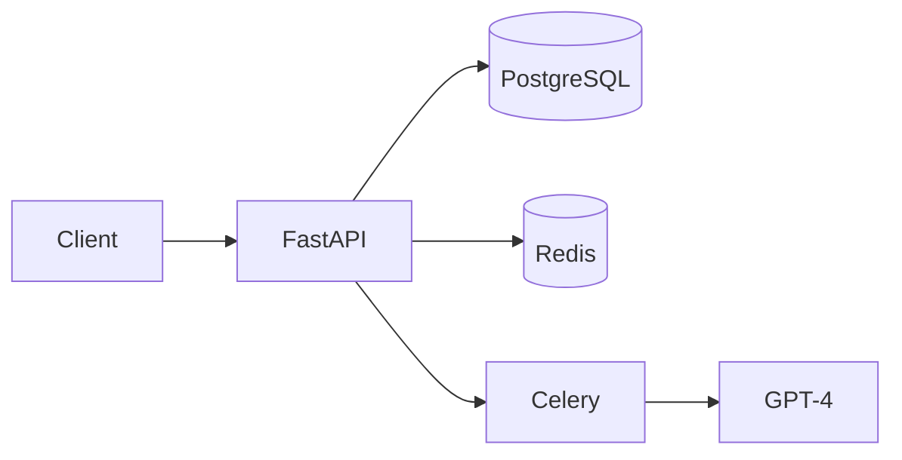
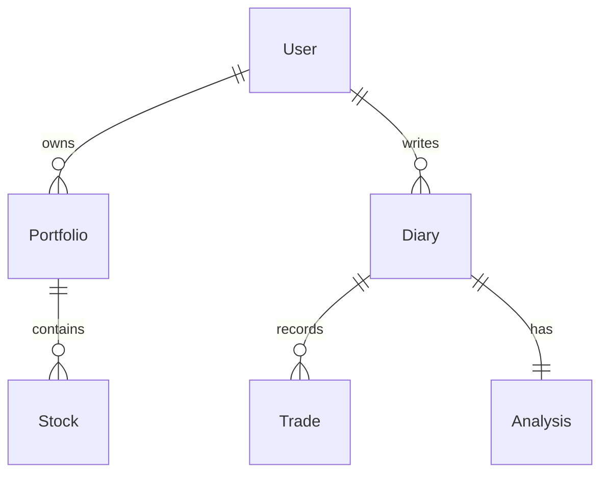
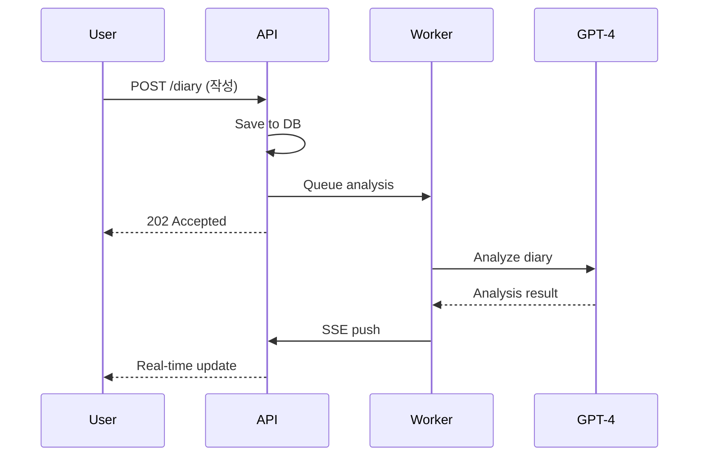

> ℹ️ **Global Rules Applied**:
> This skill adheres to the Archflow Global Rules defined in `rules/archflow-rules.md`.

# Overview Workflow

Generate a **concise 60-80 line** project overview from existing documentation.

## ⚠️ Critical Constraint

**OUTPUT MUST BE 80-120 LINES MAXIMUM.** (excluding mermaid code blocks)

This is a "5-minute read" document, NOT a detailed spec.
- Do NOT copy sections from arch.md
- Do NOT list all API endpoints
- Do NOT list all data/entities
- Just summarize and link to detailed docs
- **DO include visual diagrams** (Architecture, ERD, Key Flow)

## 💡 Recommended Model

**Sonnet** recommended (summarization task)

## 📁 Document Structure

**Input:**
```
projectRoot/
  └── docs/
        └── {serviceName}/
              ├── spec.md  # Source
              └── arch.md     # Source
```

**Output:**
```
projectRoot/
  └── docs/
        └── {serviceName}/
              └── overview.md      # Generated
```

---

## Phase -1: Service Discovery

1. **Scan `docs/`** for service directories.
2. **Select Service** (Auto or User selection).
3. **Resolve Paths**:
   - `spec.md` = `docs/{serviceName}/spec.md`
   - `arch-be.md` = `docs/{serviceName}/arch-be.md`
   - `arch-fe.md` = `docs/{serviceName}/arch-fe.md`

## Phase 0: Skill Entry

### 0-1. Collect Service Name

**If Service Discovery successful:**
- **Skip this step.**
- Proceed to 0-2 with auto-selected service name.

**If Service Discovery failed:**
**Use AskQuestion:**

```json
{
  "title": "Project Overview Generator",
  "questions": [
    {
      "id": "service_name",
      "prompt": "Which service's overview do you want to generate?",
      "options": [
        {"id": "input", "label": "I will type the service name"}
      ]
    }
  ]
}
```

### 0-2. Load Source Documents

Read:
- `docs/{serviceName}/spec.md`
- `docs/{serviceName}/arch.md`

If not found → Error: "Source documents not found. Run /spec and /arch first."

---

## Phase 1: Auto Extract

Extract from existing documents:

### From spec.md

| Field | Location |
|-------|----------|
| Project Name | Header / Service Name |
| One-liner Description | Service Description section |
| Key Features | Functional Requirements |
| Target Users | User definition section |

### From arch.md

| Field | Location |
|-------|----------|
| Tech Stack | Tech Stack section |
| Architecture Diagram | System Architecture section |
| Database Overview | DB Schema (table count, main entities) |
| **ERD (main entities)** | DB Schema → Extract 4-6 core entities and relationships |
| **Key Sequence Flow** | Sequence Diagram → Pick most important user flow |
| API Overview | API Spec (endpoint count, categories) |
| External Integrations | External API section |

---

## Phase 2: Additional Info (AskQuestion)

Ask user for info not in design docs:

```json
{
  "title": "Additional Information",
  "questions": [
    {
      "id": "repo_url",
      "prompt": "Repository URL? (leave empty if N/A)",
      "options": [
        {"id": "github", "label": "GitHub"},
        {"id": "gitlab", "label": "GitLab"},
        {"id": "other", "label": "Other (I will paste)"},
        {"id": "skip", "label": "Skip"}
      ]
    },
    {
      "id": "demo_url",
      "prompt": "Demo/Staging URL? (leave empty if N/A)",
      "options": [
        {"id": "has_url", "label": "Yes, I will provide"},
        {"id": "skip", "label": "Skip (not deployed yet)"}
      ]
    },
    {
      "id": "local_setup",
      "prompt": "How to run locally?",
      "options": [
        {"id": "docker", "label": "Docker Compose"},
        {"id": "manual", "label": "Manual setup (I will describe)"},
        {"id": "skip", "label": "Skip for now"}
      ]
    },
    {
      "id": "contact",
      "prompt": "Team contact or maintainer?",
      "options": [
        {"id": "provide", "label": "I will provide"},
        {"id": "skip", "label": "Skip"}
      ]
    }
  ]
}
```

---

## Phase 3: Generate overview.md

### Template Structure (80-120 lines MAX, excluding mermaid blocks)

```markdown
# {Project Name}

> {One-liner description - 1 sentence}

## At a Glance

| Item | Value |
|------|-------|
| Status | 🟢 Active / 🟡 Development / 🔴 Deprecated |
| Tech Stack | {main 3-4 technologies only} |
| Repository | [Link]({repo_url}) |

## What is this?

{2-3 sentences ONLY. What + Why + For whom}

## Key Features

- ✅ {Feature 1}
- ✅ {Feature 2}
- ✅ {Feature 3}
- ✅ {Feature 4}
- ✅ {Feature 5}

(MAX 5-6 features. No sub-lists.)

## Architecture

```mermaid
graph LR
    {SIMPLIFIED diagram - max 6-8 nodes}
```

| Layer | Technology |
|-------|------------|
| Backend | {1 line} |
| Database | {1 line} |
| Infra | {1 line} |

(MAX 4-5 rows. No detailed breakdown.)

## Data Model

```mermaid
erDiagram
    {Main entities only - max 4-6 entities}
    {Show key relationships}
```

(Only core entities. Link to arch.md for full schema.)

## Key Flow

```mermaid
sequenceDiagram
    {Most important user flow - max 6-8 steps}
```

(Pick ONE key flow. Link to arch.md for all flows.)

## Quick Start

```bash
git clone {repo}
cd {project}
docker-compose up -d  # or equivalent 2-3 commands
```

## Learn More

| Doc | What's inside |
|-----|---------------|
| [Requirements](spec.md) | 기능 요구사항 |
| [Architecture](arch.md) | 상세 설계, API 명세, DB 스키마 |

---
*Generated by archflow /overview*
```

### What NOT to include

❌ API endpoint lists → Link to arch.md
❌ DB schema details → Link to arch.md
❌ Data coverage lists → Link to arch.md
❌ Detailed prerequisites → Link to README or arch.md
❌ Multiple setup methods → Pick one, simplest

---

## Phase 4: Write & Confirm

1. Write `docs/{serviceName}/overview.md`
2. Show preview to user
3. Ask for any adjustments

```json
{
  "title": "Overview Generated",
  "questions": [
    {
      "id": "satisfaction",
      "prompt": "Overview generated. Any changes needed?",
      "options": [
        {"id": "done", "label": "Looks good, done!"},
        {"id": "edit", "label": "Need some edits (I will describe)"},
        {"id": "regenerate", "label": "Regenerate with different focus"}
      ]
    }
  ]
}
```

---

## Completion Message

> ✅ **Overview Generated**
>
> Output: `docs/{serviceName}/overview.md`
>
> This document provides:
> - Project introduction for new team members
> - Quick reference for stakeholders
> - Getting started guide for developers
>
> **Tip**: Keep this updated when major changes happen.

---

# Output Example (Target: ~100 lines, excluding mermaid blocks)

```markdown
# 투자일기 (Invest Diary)

> AI가 내 투자 판단을 분석해주는 개인 투자일기 시스템

## At a Glance

| Item | Value |
|------|-------|
| Status | 🟡 Development (MVP) |
| Tech Stack | FastAPI, PostgreSQL, Redis, GPT-4 |
| Repository | github.com/user/invest-diary |

## What is this?

투자일기를 작성하면 AI가 과거 투자 판단의 정확도를 분석해줍니다.
예측 정확도, 논리 일관성, 리스크 인식을 평가하여 투자 실력 향상을 돕습니다.

## Key Features

- ✅ Google OAuth 소셜 로그인
- ✅ 포트폴리오 관리 (한국/미국 주식)
- ✅ 투자일기 작성 + 매매기록
- ✅ AI 기반 투자 판단 분석 (GPT-4)
- ✅ 실시간 분석 결과 (SSE)

## Architecture



| Layer | Technology |
|-------|------------|
| Backend | FastAPI + SQLAlchemy |
| Database | PostgreSQL, Redis |
| AI | OpenAI GPT-4 |

## Data Model



## Key Flow



## Quick Start

```bash
git clone <repo> && cd invest-diary
cp .env.example .env  # Edit API keys
docker-compose up -d
```

## Learn More

| Doc | What's inside |
|-----|---------------|
| [Requirements](spec.md) | 기능 요구사항, 분석 프레임워크 |
| [Architecture](arch.md) | API 명세, DB 스키마, 시퀀스 다이어그램 |

---
*Generated by archflow /overview*
```

**Line count: ~85 lines (excluding mermaid code blocks)** ✅
