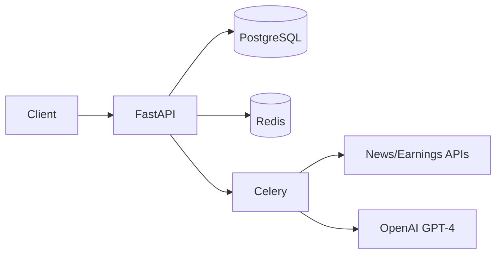

> **Language**: This skill is written in English for universal compatibility.
> Always respond in the user's language unless explicitly requested otherwise.
> If uncertain about the user's language, ask for clarification.

# Overview Workflow

Generate a concise 1-page project overview from existing documentation.

## 💡 Recommended Model

**Sonnet** recommended (summarization task)

## 📁 Document Structure

**Input:**
```
projectRoot/
  └── docs/
        └── {serviceName}/
              ├── requirements.md  # Source
              └── architect.md     # Source
```

**Output:**
```
projectRoot/
  └── docs/
        └── {serviceName}/
              └── overview.md      # Generated
```

---

## Phase 0: Skill Entry

### 0-1. Collect Service Name

**Use AskQuestion:**

```json
{
  "title": "Project Overview Generator",
  "questions": [
    {
      "id": "service_name",
      "prompt": "Which service's overview do you want to generate?",
      "options": [
        {"id": "input", "label": "I will type the service name"}
      ]
    }
  ]
}
```

### 0-2. Load Source Documents

Read:
- `docs/{serviceName}/requirements.md`
- `docs/{serviceName}/architect.md`

If not found → Error: "Source documents not found. Run /require-refine and /architect first."

---

## Phase 1: Auto Extract

Extract from existing documents:

### From requirements.md

| Field | Location |
|-------|----------|
| Project Name | Header / Service Name |
| One-liner Description | Service Description section |
| Key Features | Functional Requirements |
| Target Users | User definition section |

### From architect.md

| Field | Location |
|-------|----------|
| Tech Stack | Tech Stack section |
| Architecture Diagram | System Architecture section |
| Database Overview | DB Schema (table count, main entities) |
| API Overview | API Spec (endpoint count, categories) |
| External Integrations | External API section |

---

## Phase 2: Additional Info (AskQuestion)

Ask user for info not in design docs:

```json
{
  "title": "Additional Information",
  "questions": [
    {
      "id": "repo_url",
      "prompt": "Repository URL? (leave empty if N/A)",
      "options": [
        {"id": "github", "label": "GitHub"},
        {"id": "gitlab", "label": "GitLab"},
        {"id": "other", "label": "Other (I will paste)"},
        {"id": "skip", "label": "Skip"}
      ]
    },
    {
      "id": "demo_url",
      "prompt": "Demo/Staging URL? (leave empty if N/A)",
      "options": [
        {"id": "has_url", "label": "Yes, I will provide"},
        {"id": "skip", "label": "Skip (not deployed yet)"}
      ]
    },
    {
      "id": "local_setup",
      "prompt": "How to run locally?",
      "options": [
        {"id": "docker", "label": "Docker Compose"},
        {"id": "manual", "label": "Manual setup (I will describe)"},
        {"id": "skip", "label": "Skip for now"}
      ]
    },
    {
      "id": "contact",
      "prompt": "Team contact or maintainer?",
      "options": [
        {"id": "provide", "label": "I will provide"},
        {"id": "skip", "label": "Skip"}
      ]
    }
  ]
}
```

---

## Phase 3: Generate overview.md

### Template Structure

```markdown
# {Project Name}

> {One-liner description}

## At a Glance

| Item | Value |
|------|-------|
| Status | 🟢 Active / 🟡 Development / 🔴 Deprecated |
| Tech Stack | FastAPI, PostgreSQL, Redis, ... |
| Repository | [Link]({repo_url}) |
| Demo | [Link]({demo_url}) |

## What is this?

{2-3 sentence description of what the project does and why it exists}

## Key Features

- ✅ {Feature 1}
- ✅ {Feature 2}
- ✅ {Feature 3}
- ...

## Architecture

```mermaid
{Simplified architecture diagram from architect.md}
```

### Tech Stack

| Layer | Technology |
|-------|------------|
| Backend | {framework} |
| Database | {db} |
| Cache | {cache} |
| Queue | {queue} |
| External APIs | {apis} |

## Getting Started

### Prerequisites

- {prerequisite 1}
- {prerequisite 2}

### Local Setup

```bash
# {setup commands based on user input}
```

### Quick Test

```bash
# {test command}
```

## Documentation

| Document | Description |
|----------|-------------|
| [Requirements](requirements.md) | Functional and non-functional requirements |
| [Architecture](architect.md) | Detailed technical design |
| [Changelog](changelog.md) | Version history and changes |

## Team / Contact

{Contact info if provided}

---

*Generated by archflow /overview*
```

---

## Phase 4: Write & Confirm

1. Write `docs/{serviceName}/overview.md`
2. Show preview to user
3. Ask for any adjustments

```json
{
  "title": "Overview Generated",
  "questions": [
    {
      "id": "satisfaction",
      "prompt": "Overview generated. Any changes needed?",
      "options": [
        {"id": "done", "label": "Looks good, done!"},
        {"id": "edit", "label": "Need some edits (I will describe)"},
        {"id": "regenerate", "label": "Regenerate with different focus"}
      ]
    }
  ]
}
```

---

## Completion Message

> ✅ **Overview Generated**
>
> Output: `docs/{serviceName}/overview.md`
>
> This document provides:
> - Project introduction for new team members
> - Quick reference for stakeholders
> - Getting started guide for developers
>
> **Tip**: Keep this updated when major changes happen.

---

# Output Example

For the "Invest Diary" project:

```markdown
# Invest Diary (투자 일기)

> AI-powered investment diary that analyzes news and earnings for your portfolio

## At a Glance

| Item | Value |
|------|-------|
| Status | 🟡 Development |
| Tech Stack | FastAPI, PostgreSQL, Redis, Celery |
| Repository | github.com/user/invest-diary |

## What is this?

Invest Diary is a personal investment tracking app that automatically
collects and analyzes news, earnings reports, and market data for stocks
in your portfolio. It uses GPT-4 to provide AI-powered insights and
summaries to help you make informed investment decisions.

## Key Features

- ✅ Google OAuth authentication
- ✅ Portfolio management (manual + MTS sync)
- ✅ Automated news/earnings collection
- ✅ AI-powered analysis with GPT-4
- ✅ Real-time analysis via SSE
- ✅ Daily digest notifications

## Architecture



### Tech Stack

| Layer | Technology |
|-------|------------|
| Backend | FastAPI + Pydantic |
| Database | PostgreSQL 15 |
| Cache | Redis |
| Queue | Celery + Redis |
| LLM | OpenAI GPT-4 |
| External | Naver News, DART, Yahoo Finance |

## Getting Started

### Prerequisites

- Python 3.11+
- Docker & Docker Compose
- OpenAI API Key
- Google OAuth credentials

### Local Setup

```bash
git clone https://github.com/user/invest-diary
cd invest-diary
cp .env.example .env
# Edit .env with your API keys
docker-compose up -d
```

### Quick Test

```bash
curl http://localhost:8000/health
```

## Documentation

| Document | Description |
|----------|-------------|
| [Requirements](requirements.md) | 기능/비기능 요구사항 |
| [Architecture](architect.md) | 상세 기술 설계 |

---

*Generated by archflow /overview*
```
