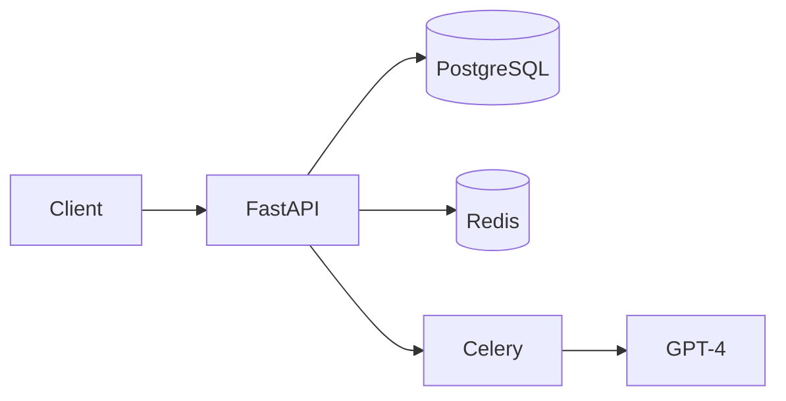
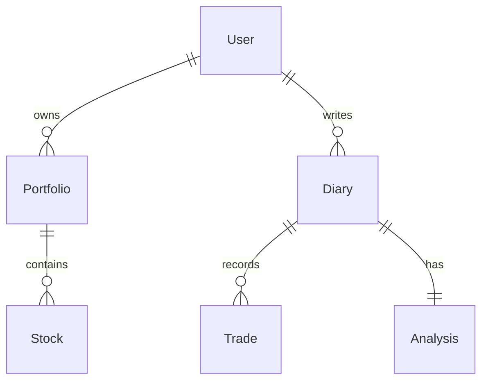
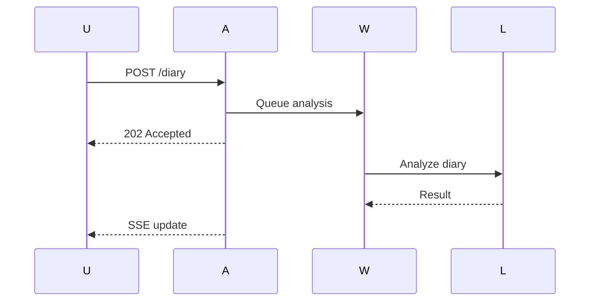

> **Global Rules**: Adheres to `rules/archflow-rules.md`.

# Overview Workflow

Generate a **concise 80-120 line** project overview (excluding mermaid blocks).
**Model**: Sonnet (summarization task).

## Critical Constraint

**OUTPUT MUST BE 80-120 LINES MAXIMUM.** (excluding mermaid code blocks)
This is a "5-minute read" document, NOT a detailed spec.
- Do NOT copy sections from arch.md
- Do NOT list all API endpoints or entities
- Summarize and link to detailed docs
- **DO include visual diagrams** (Architecture, ERD, Key Flow)

## Document Structure

Input: `docs/{serviceName}/spec.md`, `arch-be.md`, `arch-fe.md`
Output: `docs/{serviceName}/overview.md`

---

## Phase -1: Service Discovery

Scan `docs/`, select service (auto or user), resolve paths: `spec.md`, `arch-be.md`, `arch-fe.md`.

## Phase 0: Skill Entry

### 0-1. Collect Service Name

If Service Discovery failed:

```json
{"title":"Project Overview Generator","questions":[{"id":"service_name","prompt":"Which service's overview do you want to generate?","options":[{"id":"input","label":"I will type the service name"}]}]}
```

### 0-2. Load Source Documents

Read `docs/{serviceName}/spec.md` and `arch.md`.
If not found -> Error: "Source documents not found. Run /spec and /arch first."

---

## Phase 1: Auto Extract

### From spec.md

| Field | Location |
|-------|----------|
| Project Name | Header / Service Name |
| One-liner Description | Service Description section |
| Key Features | Functional Requirements |
| Target Users | User definition section |

### From arch.md

| Field | Location |
|-------|----------|
| Tech Stack | Tech Stack section |
| Architecture Diagram | System Architecture section |
| DB Overview + **ERD** | DB Schema -> table count + 4-6 core entities |
| **Key Sequence Flow** | Sequence Diagram -> most important user flow |
| API Overview | API Spec (endpoint count, categories) |
| External Integrations | External API section |

---

## Phase 2: Additional Info (AskQuestion)

```json
{"title":"Additional Information","questions":[
  {"id":"repo_url","prompt":"Repository URL?","options":[{"id":"github","label":"GitHub"},{"id":"gitlab","label":"GitLab"},{"id":"other","label":"Other"},{"id":"skip","label":"Skip"}]},
  {"id":"demo_url","prompt":"Demo/Staging URL?","options":[{"id":"has_url","label":"Yes, I will provide"},{"id":"skip","label":"Skip"}]},
  {"id":"local_setup","prompt":"How to run locally?","options":[{"id":"docker","label":"Docker Compose"},{"id":"manual","label":"Manual setup"},{"id":"skip","label":"Skip"}]},
  {"id":"contact","prompt":"Team contact?","options":[{"id":"provide","label":"I will provide"},{"id":"skip","label":"Skip"}]}
]}
```

---

## Phase 3: Generate overview.md

### Template (80-120 lines MAX, excluding mermaid)

```markdown
# {Project Name}
> {One-liner description - 1 sentence}

## At a Glance
| Item | Value |
|------|-------|
| Status | Active / Development / Deprecated |
| Tech Stack | {main 3-4 technologies only} |
| Repository | [Link]({repo_url}) |

## What is this?
{2-3 sentences ONLY. What + Why + For whom}

## Key Features
- {Feature 1-5, MAX 6. No sub-lists.}

## Architecture
```mermaid
graph LR
    {SIMPLIFIED diagram - max 6-8 nodes}
```
| Layer | Technology |
|-------|------------|
| Backend | {1 line} |
| Database | {1 line} |
(MAX 4-5 rows)

## Data Model
```mermaid
erDiagram
    {4-6 core entities with key relationships}
```
(Link to arch.md for full schema.)

## Key Flow
```mermaid
sequenceDiagram
    {Most important flow - max 6-8 steps}
```
(ONE flow only. Link to arch.md for all.)

## Quick Start
```bash
git clone {repo} && cd {project}
docker-compose up -d  # or 2-3 commands
```

## Learn More
| Doc | What's inside |
|-----|---------------|
| [Requirements](spec.md) | ... |
| [Architecture](arch.md) | ... |
---
*Generated by archflow /overview*
```

### What NOT to include

API endpoint lists, DB schema details, detailed prerequisites, multiple setup methods -> link to arch.md.

---

## Phase 4: Write & Confirm

Write `docs/{serviceName}/overview.md`, show preview, ask:

```json
{"title":"Overview Generated","questions":[{"id":"satisfaction","prompt":"Overview generated. Any changes needed?","options":[{"id":"done","label":"Looks good, done!"},{"id":"edit","label":"Need some edits"},{"id":"regenerate","label":"Regenerate with different focus"}]}]}
```

> **Overview Generated** - Output: `docs/{serviceName}/overview.md`
> - Project introduction for new team members
> - Quick reference for stakeholders
> - Getting started guide for developers
>
> **Tip**: Keep updated when major changes happen.

---

# Output Example (~85 lines excluding mermaid)

```markdown
# 투자일기 (Invest Diary)
> AI가 내 투자 판단을 분석해주는 개인 투자일기 시스템

## At a Glance
| Item | Value |
|------|-------|
| Status | Development (MVP) |
| Tech Stack | FastAPI, PostgreSQL, Redis, GPT-4 |
| Repository | github.com/user/invest-diary |

## What is this?
투자일기를 작성하면 AI가 과거 투자 판단의 정확도를 분석해줍니다.
예측 정확도, 논리 일관성, 리스크 인식을 평가하여 투자 실력 향상을 돕습니다.

## Key Features
- Google OAuth 소셜 로그인
- 포트폴리오 관리 (한국/미국 주식)
- 투자일기 작성 + 매매기록
- AI 기반 투자 판단 분석 (GPT-4)
- 실시간 분석 결과 (SSE)

## Architecture

```mermaid
graph LR
    Client --> API[FastAPI] --> DB[(PostgreSQL)]
    API --> Cache[(Redis)]
    API --> Worker[Celery] --> LLM[GPT-4]
```
| Layer | Technology |
|-------|------------|
| Backend | FastAPI + SQLAlchemy |
| Database | PostgreSQL, Redis |
| AI | OpenAI GPT-4 |

## Data Model

```mermaid
erDiagram
    User ||--o{ Portfolio : owns
    User ||--o{ Diary : writes
    Portfolio ||--o{ Stock : contains
    Diary ||--o{ Trade : records
    Diary ||--|| Analysis : has
```

## Key Flow

```mermaid
sequenceDiagram
    U->>A: POST /diary
    A->>W: Queue analysis
    A-->>U: 202 Accepted
    W->>L: Analyze diary
    L-->>W: Result
    A-->>U: SSE update
```

## Quick Start
```bash
git clone <repo> && cd invest-diary
cp .env.example .env  # Edit API keys
docker-compose up -d
```

## Learn More
| Doc | What's inside |
|-----|---------------|
| [Requirements](spec.md) | 기능 요구사항, 분석 프레임워크 |
| [Architecture](arch.md) | API 명세, DB 스키마, 시퀀스 다이어그램 |
---
*Generated by archflow /overview*
```
