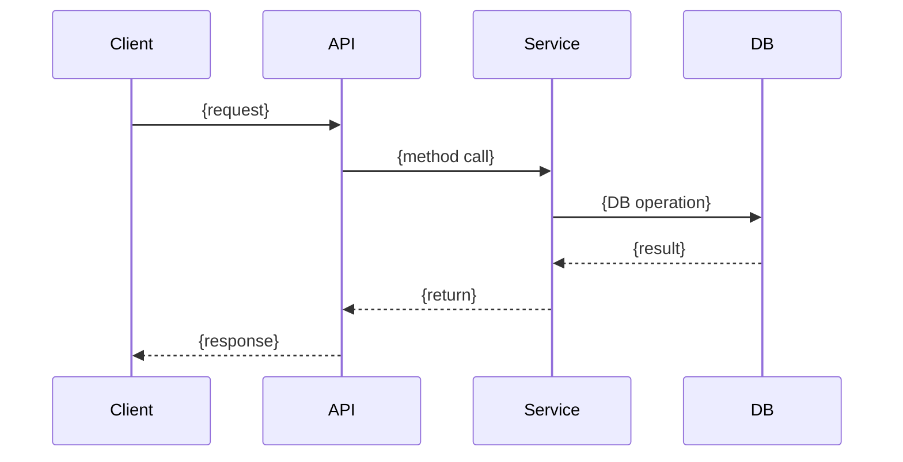

<!-- Archflow Template: Architecture Design Document -->
<!-- Generated from: architect skill -->
<!-- This template is used to structure design documents -->

# Feature Design Doc: {Feature Name}

> Created: {date}
> Service: {serviceName}
> Requirements document: docs/{serviceName}/requirements.md

## 0. Summary

### Goal
(Goal this feature aims to achieve - 1-2 sentences)

### Non-goals
- (Items excluded from this scope)

### Success metrics
- (List of success criteria)

---

## 1. Scope

### In scope
- (Items included in this implementation)

### Out of scope
- (Future improvements or excluded items)

---

## 1.5. Tech Stack

| Item | Value |
|------|-------|
| Language | {language and version} |
| Framework | {framework} |
| DB | {DB type and version} |
| ORM | {ORM package or "Raw SQL"} |
| 3rd-party | {Redis, Kafka, etc.} |
| Infra | {K8s, Docker, etc.} |

---

## 2. Architecture Impact

### Components

| Service / Module | Responsibility | Change type |
|-----------------|----------------|-------------|
| {service name} | {role} | new / modify |

### Data

#### Database changes

**New table: `{table name}`**

| Column | Type | Constraints | Description |
|--------|------|-------------|-------------|
| id | INTEGER | PK, AUTO_INCREMENT | Primary key |
| {column name} | {type} | {constraints} | {description} |
| created_at | TIMESTAMP | NOT NULL, DEFAULT NOW() | Creation timestamp |

**Existing table modification: `{table name}`**

| Column | Type | Change | Description |
|--------|------|--------|-------------|
| id | INTEGER | Maintain | PK |
| {column name} | {type} | **New** / **Delete** / Maintain | {description} |

#### Migration Summary (when manual SQL selected)

| Change Type | Table | Content |
|------------|-------|---------|
| CREATE TABLE | {table} | {description} |
| ALTER TABLE | {table} | {change content} |
| CREATE INDEX | {table} | {index description} |

---

## 3. Code Mapping

| Feature | File | Class | Method | Action |
|---------|------|-------|--------|--------|
| {feature} | {full file path} | {class name} | {method name} | {call location and code to add} |

---

## 4. Implementation Plan

### 📂 Required Reference Files (Must read before implementation)

| File | Reference Purpose |
|------|------------------|
| {file path 1} | {What to check in this file - patterns, style, dependencies, etc.} |
| {file path 2} | {reference purpose} |
| {file path 3} | {reference purpose} |

⚠️ **When running implement skill, read above files first to understand patterns**

### Step-by-Step Implementation

1. **Step 1: {step name}**
   - {detailed task 1}
   - {detailed task 2}

2. **Step 2: {step name}**
   - {detailed task}

3. **Step 3: {step name}**
   - {detailed task}

---

## 5. Sequence Diagram

### {Flow name}



---

## 6. API Specification

### {API name}

**Endpoint**: `{METHOD} /api/v1/{path}`

**Request**:
```json
{
  "field": "value"
}
```

**Response**:
```json
{
  "success": true,
  "data": {}
}
```

---

## 7. Infra/Ops

### Environment Variables
| Variable | Description | Default |
|----------|-------------|---------|
| {VAR_NAME} | {description} | {value} |

### Deployment Changes
- (If needed)

---

## 8. Risks & Tradeoffs (Debate Conclusion)

### Chosen Option
- {adopted design approach}

### Rejected Alternatives
- {unadopted items and reasons}

### Reasoning
- Project constraints: {reason}
- Best practice adoption: {applied parts}
- Future improvement points: {what to do later}

### Assumptions
- **Confirmed**: {clearly decided in debate}
- **Estimated**: {assumed due to lack of confirmation - needs verification in implementation}

---

## 9. Error/Auth/Data Checklist (3 Essential Checks)

### Error Handling

| Situation | Location | Handling Method | Response |
|-----------|----------|----------------|----------|
| {exception scenario} | {file/method} | {try-catch/exception propagation/logging} | {HTTP code, error message} |

### Authorization

| Action | Required Permission | Validation Location | On Failure |
|--------|-------------------|-------------------|-----------|
| {API/feature} | {role/permission} | {middleware/service} | {403/401 response} |

### Data Integrity

| Validation Item | Validation Timing | On Failure |
|----------------|------------------|-----------|
| {FK existence} | {before save} | {400 + message} |
| {Duplicate check} | {on create} | {409 Conflict} |
| {Range validation} | {on input} | {422 + details} |

⚠️ **If this section is empty, 80% of implementation will be unstable** - Must complete
